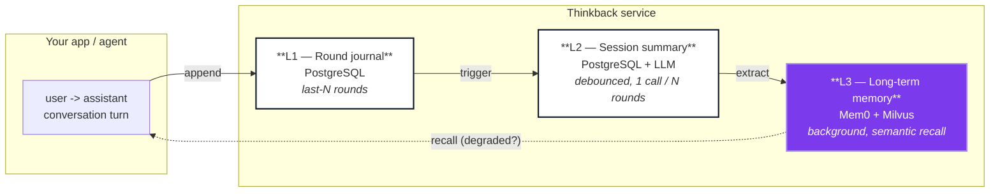
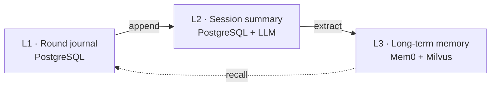

<!-- 顶部对齐排版,GitHub 原生渲染无需额外样式 -->
<div align="center">


<br>


# Thinkback

**Self-hosted memory service for AI conversations.**

[](../../releases)
[](../../commits/master)
[](LICENSE)
[](https://www.python.org/downloads/)

Thinkback gives AI assistants and agents persistent memory across conversations. It keeps
short-term context, running session summaries, and long-term user facts as **three explicit
layers** — exposed through one idempotent HTTP/gRPC API — and stays observable when something
fails.

Built on [Mem0](https://github.com/mem0ai/mem0) as its long-term engine, plus PostgreSQL and Milvus.

<br>

[](https://fastapi.tiangolo.com)
[](https://docs.astral.sh/ruff/)
[](https://mypy.readthedocs.io)
[](.github/workflows/ci.yml)
[](.github/CONTRIBUTING.md)
[](#-acknowledgments)

<br>

[](../../stargazers)
[](../../network/members)
[](../../watchers)
[](https://hub.docker.com/r/mcgrapeng/thinkback)

[**English**](README.md) · [**中文**](README.zh-CN.md) · [Docs](docs/) · [Changelog](CHANGELOG.md) · [Roadmap](docs/ROADMAP.md)

[Report Bug](.github/ISSUE_TEMPLATE/bug_report.md) · [Request Feature](.github/ISSUE_TEMPLATE/feature_request.md)

> **Try the admin console live** — `git clone https://github.com/mcgrapeng/thinkback.git && make dev`
> opens both API and web UI at `localhost:7001` with mock data.

**Quick links:**
[Why Thinkback](#-why-thinkback) ·
[How it works](#-how-it-works) ·
[Screenshots](#-screenshots) ·
[Quickstart](#-quickstart) ·
[API Reference](#-api-reference) ·
[Architecture](#-architecture) ·
[FAQ](#-faq) ·
[Community](#-community) ·
[Contributing](#-contributing)

</div>

---

## ✦ At a glance

Thinkback is the **memory layer for AI applications** that need to remember what happened in past
conversations. It's the difference between an AI that forgets you after every message and one that
remembers your preferences, past issues, and context.

- 🧠 **Three memory layers** that don't fight each other — short-term context, running summaries, long-term facts
- 🔌 **HTTP + gRPC** with one shared Pydantic schema, pick your protocol
- ✅ **Idempotent writes** with `journal_id` fingerprints — replay-safe
- 🚨 **Explicit degradation** signals when the LLM or vector store is down
- 🛠️ **Self-hosted** with Apache 2.0 — your data never leaves your infra
- 🎛️ **Full admin dashboard** to inspect and repair what the memory layer actually did

---

## ✦ Table of Contents

| Section | What you'll find |
| --- | --- |
| [At a glance](#-at-a-glance) | 6-line summary + key capabilities |
| [Why we built this](#-why-we-built-this) | The origin story |
| [How it works](#-how-it-works) | Architecture flow with diagram |
| [How it compares](#-how-it-compares) | Thinkback vs Mem0 SDK / LangChain / DIY |
| [Why Thinkback](#-why-thinkback) | What you get vs what you build |
| [Memory model](#-memory-model) | L1 / L2 / L3 layer separation |
| [Capabilities](#-capabilities) | Full feature list |
| [Screenshots](#-screenshots) | Admin dashboard visual tour |
| [Quickstart](#-quickstart) | 3-step curl walkthrough |
| [API Reference](#-api-reference) | 26+ endpoints |
| [Architecture](#-architecture) | Non-mermaid architecture diagram |
| [Performance](#-performance) | Benchmarks |
| [Configuration](#-configuration) | Env vars |
| [Roadmap](#-roadmap) | What's next |
| [Project layout](#-project-layout) | Repo structure |
| [Extending](#-extending) | How to customize |
| [Development](#-development) | Dev setup |
| [Documentation](#-documentation) | Full docs |
| [Community](#-community) | Discussions / Issues |
| [FAQ](#-faq) | Frequently asked questions |
| [Contributing](#-contributing) | How to help |
| [Featured by](#-featured-by) | Used by |
| [Sponsors](#-sponsors) | Sponsor us |
| [License](#-license) | Apache 2.0 |
| [Acknowledgments](#-acknowledgments) | Credits |

---

## ✦ Why we built this

> *We were shipping a multi-tenant customer-support agent. After three rewrites of "the memory
> layer" — once in Postgres, once in Redis, once as a Sidekiq cron job — we realised the memory
> layer wasn't our product. It was a tax on the product. Thinkback is the thing we wish existed
> before we started: a boring, reliable, observable memory service that does not go down at 3am.*

The pattern: you ship an AI that **works** in the first conversation but **fails** in the tenth because
it forgets the user's preferences, the issue from yesterday, or the tool call you spent three turns
debugging. Every AI app eventually needs persistent memory. Thinkback is the version of that you
don't have to build yourself.

---

## ✦ How it works

A conversation flows through three layers. Each layer has a strict ownership — nothing
cross-writes.



A request flow:

1. **Your app** calls `POST /memory/append` with a `user → assistant` round
2. **L1** stores the raw round (PostgreSQL, append-only)
3. **L2** is debounced-updated to a running session summary (LLM call)
4. **L3** is background-extracted by Mem0 into a vector store (Milvus)
5. On the next `POST /memory/recall`, **L1 / L2 / L3** are queried in parallel, and the response is marked `degraded=true` if any layer is unavailable — never a half-answer

---

## ✦ How it compares

| | **Raw Mem0 SDK** | **LangChain memory** | **DIY Postgres + pgvector** | **Thinkback** |
| --- | :---: | :---: | :---: | :---: |
| Idempotent writes across retries | ❌ | ⚠️ | ⚠️ (you build) | ✅ |
| Background extraction with backpressure | ❌ | ❌ | ❌ | ✅ |
| Explicit `degraded` signal when LLM down | ❌ | ❌ | ❌ | ✅ |
| Three-layer separation (round/summary/long-term) | ❌ | ❌ | ❌ | ✅ |
| Task state machine + dead-lettering | ❌ | ❌ | ❌ | ✅ |
| Bitemporal validity (`valid_at` / `invalid_at`) | ❌ | ❌ | ⚠️ (you build) | ✅ |
| Admin web UI (governance + key mgmt) | ❌ | ❌ | ❌ | ✅ |
| HTTP + gRPC with shared Pydantic schema | ❌ (Python only) | ❌ (Python only) | ⚠️ (you build) | ✅ |
| OpenAI-compatible LLM/embedding endpoints | ✅ | ✅ | ✅ | ✅ |
| Production deployable (K8s, observability) | ❌ | ❌ | ⚠️ (you build) | ✅ |

---

## ✦ Why Thinkback

> **Mem0 is an excellent memory engine. Using it directly gives you fact extraction and semantic recall. It does not give you a _service_.**

Most production memory needs look like this when you wire mem0 into your own app:

| You would have to build | Thinkback provides |
| --- | --- |
| Session-level context (last-N rounds, running summary) | L1 journal + L2 debounced summaries in PostgreSQL |
| Exactly-once writes across retries and replays | `journal_id` fingerprints, idempotent `append` |
| Behaviour when the LLM / embedding / vector store is down | Explicit `degraded=True` + reasons — never a half-answer |
| Background extraction with backpressure | Async L3 queue with capacity limits, drain, orphan-task reclaim |
| An API to list / edit / delete long-term memories | Full management surface with scoped deletes and audit |
| Observability of what the memory layer did | Task state machine, retry counts, last error, admin dashboard |
| Safe, scoped deletion | `MEMORY` / `SESSION` / `ALL` scopes with tombstones |
| Schema and readiness for deployment | Alembic migrations, liveness/readiness probes, metrics |

If your use case is "one process, one user, no retries" — call Mem0 directly. If you are
shipping a service that other teams depend on, this is the gap Thinkback fills.

---

## ✦ Memory model

Three explicit layers with strict ownership — layers flow one way and never cross-write.

| Layer | Stores | Backed by | Refresh policy |
| --- | --- | --- | --- |
| **L1 — Round journal** | Each complete `user → assistant` round | PostgreSQL | Append-only, retain last *N* rounds |
| **L2 — Session summary** | Running context for the session | PostgreSQL + LLM | Debounced — one LLM call per *N* rounds |
| **L3 — Long-term memory** | Cross-session facts and preferences | Mem0 + Milvus | Background extraction, semantic recall |



---

## ✦ Capabilities

### Key features at a glance

<table>
<tr>
<td width="50%" valign="top">

**🧠 Three-layer memory model**
Short-term context · running summaries · long-term facts. Each layer has a strict ownership — no cross-writes.

</td>
<td width="50%" valign="top">

**✅ Idempotent writes**
`journal_id` fingerprints make replays safe. Append the same round twice, get the same result. No duplicate memories, no corruption.

</td>
</tr>
<tr>
<td width="50%" valign="top">

**🚨 Explicit degradation**
When the LLM or vector store is down, responses are marked `degraded=True` with `degradation_reasons`. Never a half-answer — always honest.

</td>
<td width="50%" valign="top">

**🎛️ Full admin dashboard**
React 19 web UI to inspect every memory, replay every task, revoke or supersede on demand. Plus a `⌘K` command palette for power users.

</td>
</tr>
<tr>
<td width="50%" valign="top">

**🔌 HTTP + gRPC, one schema**
Pydantic models are the source of truth. Pick your protocol, share your types. Strict typing end-to-end with `mypy --strict`.

</td>
<td width="50%" valign="top">

**🛠️ Self-hosted, Apache 2.0**
Your data never leaves your infra. Postgres + Milvus + Mem0 — all open source. Kubernetes-native with liveness/readiness probes.

</td>
</tr>
</table>

### Memory model

- **Three explicit layers** with no cross-write — Mem0 owns L3 storage entirely
- **Bitemporal validity** — `valid_at` / `invalid_at`; superseding a fact keeps history rather than overwriting it
- **Business index state machine** — `ACTIVE` / `DELETED` / `SUPERSEDED` / `SUPPRESSED`, decoupled from backend storage state
- **Decay sweeper** — aged, rarely-recalled long-tail memories are suppressed (unreachable, never deleted); recalling one strengthens it back. *Off by default.*

### Reliability

- **Idempotent writes** — `request_id` / `round_id` fingerprints make replays safe
- **Scoped deletes** — by memory, by session, or user-wide, with tombstones
- **Explicit degradation** — `degraded=True` plus `degradation_reasons`, so callers can tell a real answer from a degraded one
- **Background task governance** — state machine with optimistic locking, retry budgets, dead-lettering, and orphan-task reclaim on cold start

### Production surface

- **HTTP + gRPC** — one shared Pydantic schema, pick the protocol your client prefers
- **Strictly typed end-to-end** — Pydantic v2 + `mypy --strict`; no `Any` at API boundaries
- **OpenAI-compatible endpoints** — bring your own LLM and embedding URLs
- **Kubernetes-native** — liveness/readiness probes, Prometheus metrics, Alembic migrations
- **Deterministic test suite** — in-memory + fake Mem0 backends; CI needs no real services
- **Admin dashboard** — inspect and repair what the memory layer actually did

### Integration & ops

- **v1 公开 API** — API key + Scope + Tenant + 限流 + Idempotency-Key,实时生效
- **mem0 提示词深度管理** — 抽取约束 / 更新策略 / 召回回答 三大 prompt 实时编辑
- **Prometheus metrics** — request latency, queue depth, task states, L3 worker stats
- **OpenAPI / Swagger UI** — at `/docs` (auto-generated, kept in sync with Pydantic)

### Typical uses

- Conversation assistants with session-spanning memory
- Customer support bots recalling past tickets and preferences
- Multi-turn agents holding task context across tool calls and interruptions
- Self-hosted AI infrastructure that must keep data on-prem

---

## ✦ Screenshots

### Overview — at-a-glance system health

<div align="center">
  
  <p><em>96px hero KPI with 24h sparkline · System Pulse with 4 sub-KPIs · Needs Attention list · 5min throughput heatmap · Recent governance audit timeline</em></p>
</div>

### Memory browser — search, source back-link, compare

<div align="center">
  
  <p><em>Editorial card list with status chips · ⌘K command palette · keyboard nav (j/k/x) · URL deep links</em></p>
</div>

<div align="center">
  
  <p><em>Detail drawer: every field has an ⓘ tooltip explaining meaning · source back-link to journal · recall count</em></p>
</div>

### Tasks — KPI sparklines, state machine, dead-lettering

<div align="center">
  
  <p><em>4 KPIs with sparklines (color-coded: red for FAILED, violet for DEAD LETTER) · status tabs · task cards with retry count</em></p>
</div>

### Governance — scoped delete with confirmation

<div align="center">
  
  <p><em>Delete memory form: scope selector (memory / session / all) · semantic-color left border · confirm dialog · Spinner during execution</em></p>
</div>

### Integration & mem0 prompt management

<div align="center">
  
  <p><em>API Key management: list · generate (one-time plaintext) · revoke (soft delete) · protocol overview · endpoints reference · error codes</em></p>
</div>

<div align="center">
  
  <p><em>mem0 深度管理: 4 阶段流水线说明 · custom_instructions / update_memory_prompt / memory_answer_prompt · 调优提示 + 示例</em></p>
</div>

### Audit timeline + system config

<div align="center">
  
  <p><em>Audit timeline: color-coded action dots (delete / update / rebuild) · expandable JSON details · action filter</em></p>
</div>

<div align="center">
  
  <p><em>System config: grouped by category (PostgreSQL, L2, L3, etc.) · SECRET badges · search aliases (数据库 / 向量库)</em></p>
</div>

### Mobile-responsive

<div align="center">
  
  <p><em>Same dashboard adapted for narrow viewports · mobile-friendly card layout</em></p>
</div>

---

## ✦ Quickstart

### Run the service

```bash
git clone https://github.com/mcgrapeng/thinkback.git
cd thinkback

# install dependencies
uv sync --frozen --group dev

# start a local PostgreSQL (optional — point .env at your own instance instead)
make dev-up

# configure
cp .env.example .env   # fill in MEMORY_LLM_KEY, MILVUS_URL, LLM & embedding endpoints

# run the API
uv run uvicorn thinkback.api.app:app --host 0.0.0.0 --port 8000
```

Or run both the API and the admin web UI in one step (ports auto-fallback when busy):

```bash
make dev
```

Health check:

```bash
curl http://localhost:8000/health/ready
```

### Write a memory round

`POST /memory/append` records one complete `user → assistant` round and triggers L1/L2
updates plus background L3 extraction.

```bash
curl -X POST http://localhost:8000/memory/append \
  -H "Content-Type: application/json" \
  -d '{
    "request_id": "req-001",
    "user_id": "alice",
    "session_id": "support-001",
    "round_id": "round-001",
    "source_timestamp": "2026-01-15T10:00:00Z",
    "messages": [
      { "message_id": "m1", "role": "user",
        "content": "I prefer dark mode and vim keybindings.",
        "timestamp": "2026-01-15T10:00:00Z" },
      { "message_id": "m2", "role": "assistant",
        "content": "Noted. I will remember that.",
        "timestamp": "2026-01-15T10:00:02Z" }
    ]
  }'
```

```json
{
  "status": "completed",
  "task_id": "task-abc123",
  "round_id": "round-001",
  "l3_events": []
}
```

### Recall relevant memory

`POST /memory/recall` returns L1/L2/L3 hits, with an explicit degradation signal when a
layer is unavailable.

```bash
curl -X POST http://localhost:8000/memory/recall \
  -H "Content-Type: application/json" \
  -d '{
    "user_id": "alice",
    "session_id": "support-002",
    "query": "What UI preferences does this user have?",
    "l3_limit": 3
  }'
```

```json
{
  "status": "ok",
  "degraded": false,
  "degradation_reasons": [],
  "items": [
    { "layer": "L3", "content": "Prefers dark mode and vim keybindings.", ... }
  ]
}
```

### Business system integration (v1 API)

For production integrations, use the v1 public API with API key + scope-based auth.

<details>
<summary><b>Python SDK example</b></summary>

```python
from thinkback import Thinkback

client = Thinkback(api_key="tbk_live_xxxxxxxx", tenant_id="tenant_001")

# Append a memory round (triggers L1/L2/L3 pipeline)
response = client.memory.append(
    request_id="req-001",
    user_id="alice",
    session_id="support-001",
    round_id="round-001",
    messages=[
        {
            "message_id": "m1",
            "role": "user",
            "content": "I prefer dark mode and vim keybindings.",
            "timestamp": "2026-01-15T10:00:00Z",
        },
        {
            "message_id": "m2",
            "role": "assistant",
            "content": "Noted. I will remember that.",
            "timestamp": "2026-01-15T10:00:02Z",
        },
    ],
)
print(response.task_id)  # track async L3 extraction

# Recall relevant memories
result = client.memory.recall(
    user_id="alice",
    session_id="support-002",
    query="What UI preferences does this user have?",
    intent="chat",
    l3_limit=5,
)
for item in result.items:
    print(f"[{item.layer}] {item.content}")
```

</details>

<details>
<summary><b>TypeScript SDK example</b></summary>

```typescript
import { Thinkback } from "@thinkback/sdk";

const client = new Thinkback({
  apiKey: process.env.THINKBACK_API_KEY,
  tenantId: "tenant_001",
});

// Append a memory round
await client.memory.append({
  requestId: "req-001",
  userId: "alice",
  sessionId: "support-001",
  roundId: "round-001",
  messages: [
    { messageId: "m1", role: "user",
      content: "I prefer dark mode and vim keybindings.",
      timestamp: "2026-01-15T10:00:00Z" },
    { messageId: "m2", role: "assistant",
      content: "Noted. I will remember that.",
      timestamp: "2026-01-15T10:00:02Z" },
  ],
});

// Recall with degradation detection
const result = await client.memory.recall({
  userId: "alice",
  sessionId: "support-002",
  query: "What UI preferences does this user have?",
  intent: "chat",
  l3Limit: 5,
});

if (result.degraded) {
  console.warn("Memory service degraded:", result.degradationReasons);
}
for (const item of result.items) {
  console.log(`[${item.layer}] ${item.content}`);
}
```

</details>

<details>
<summary><b>cURL</b></summary>

```bash
# Generate an API key from the admin console at /integration
curl -X POST https://your-thinkback/v1/memory/recall \
  -H "Authorization: Bearer tbk_live_xxxxxxxx" \
  -H "X-Tenant-Id: tenant_001" \
  -H "Content-Type: application/json" \
  -H "Idempotency-Key: idem_001" \
  -d '{
    "user_id": "u_8421",
    "session_id": "s_001",
    "query": "用户偏好什么编辑器?",
    "intent": "chat",
    "l3_limit": 5
  }'
```

</details>

See [`docs/specs/2026-10-08-thinkback-integration-protocol-v1.md`](docs/specs/2026-10-08-thinkback-integration-protocol-v1.md) for the full spec.

---

## ✦ What's new in v1.0

> **🎉 2026-10 — Thinkback v1.0 is the first public release.**

| Area | Highlights |
| --- | --- |
| **Memory model** | Three-layer (L1/L2/L3) with bitemporal validity (`valid_at` / `invalid_at`) |
| **API** | HTTP + gRPC, 26+ endpoints, v1 public integration protocol |
| **Admin dashboard** | React 19 SPA: 7 pages, ⌘K command palette, keyboard nav (j/k/x), URL deep links |
| **Governance** | Scoped delete (memory/session/ALL), idempotent writes, audit trail |
| **Operability** | K8s-native, Prometheus metrics, Alembic migrations, 615+ tests |
| **Integration** | v1 public API with API key + Scope + Tenant + rate limit + idempotency |
| **mem0 prompts** | Real-time editing of `custom_instructions` / `update_memory_prompt` / `memory_answer_prompt` |

See [CHANGELOG](CHANGELOG.md) for the full release notes.

---

## ✦ API Reference

### Memory core (`/memory/*`)

| Method | Path | Purpose |
| --- | --- | --- |
| `POST` | `/memory/append` | Write a `user → assistant` round; triggers L1/L2/L3 updates |
| `POST` | `/memory/recall` | Retrieve relevant memories (L1/L2/L3) with degradation signal |
| `GET` | `/memory` | List memories with filters (`user_id`, `statuses`, pagination) |
| `GET` | `/memory/{memory_id}` | Fetch one memory with full metadata |
| `PUT` | `/memory/{memory_id}` | Update memory text; preserved history |
| `DELETE` | `/memory/{memory_id}` | Scoped delete (`MEMORY` / `SESSION` / `ALL`) |
| `GET` | `/memory/tasks/{task_id}` | Async task state (retry, last_error, result) |
| `GET` | `/memory/l3/status` | L3 background queue and worker status |

### Business integration (`/v1/memory/*`)

| Method | Path | Required scope | Purpose |
| --- | --- | --- | --- |
| `POST` | `/v1/memory/append` | `memory:append` | Write memory round (v1 protocol) |
| `POST` | `/v1/memory/recall` | `memory:recall` | Recall memories (v1 protocol) |
| `GET` | `/v1/memory` | `memory:read` | List memories |
| `GET/PUT/DELETE` | `/v1/memory/{id}` | `memory:read/update/delete` | CRUD |

### Admin (`/admin/api/*`)

| Method | Path | Purpose |
| --- | --- | --- |
| `GET` | `/admin/api/overview` | System pulse: 4 hero KPIs + system pulse + L3 status + recent audit |
| `GET` | `/admin/api/tasks` | Task list with `statuses` filter, pagination |
| `GET` | `/admin/api/memories` | Memory list with `user_id` / `statuses`, source back-link |
| `GET` | `/admin/api/audit` | Audit log with `action` filter (delete / update / rebuild) |
| `POST` | `/admin/api/{delete,update,rebuild}` | Governance actions with `operation_id` idempotency |
| `GET` | `/admin/api/mem0/configs` | List mem0 prompt configurations |
| `PUT` | `/admin/api/mem0/configs/{key}` | Update mem0 prompt (real-time) |
| `GET` | `/admin/api/integration/keys` | List API keys |
| `POST` | `/admin/api/integration/keys` | Generate new API key |

gRPC surface mirrors the same operations in `proto/memory.proto` for service-to-service calls.

Full interactive API documentation at **`/docs`** (Swagger UI) and **`/redoc`**.

### Request / Response at a glance

<details>
<summary><b>POST /memory/append</b> — Write a user → assistant round</summary>

**Request:**
```json
{
  "request_id": "req-001",
  "user_id": "alice",
  "session_id": "support-001",
  "round_id": "round-001",
  "source_timestamp": "2026-01-15T10:00:00Z",
  "messages": [
    { "message_id": "m1", "role": "user",
      "content": "I prefer dark mode and vim keybindings.",
      "timestamp": "2026-01-15T10:00:00Z" },
    { "message_id": "m2", "role": "assistant",
      "content": "Noted. I will remember that.",
      "timestamp": "2026-01-15T10:00:02Z" }
  ]
}
```

**Response:**
```json
{
  "status": "completed",
  "task_id": "task-abc123",
  "round_id": "round-001",
  "l3_events": []
}
```

</details>

<details>
<summary><b>POST /memory/recall</b> — Retrieve relevant memories</summary>

**Request:**
```json
{
  "user_id": "alice",
  "session_id": "support-002",
  "query": "What UI preferences does this user have?",
  "intent": "chat",
  "l3_limit": 5
}
```

**Response:**
```json
{
  "status": "ok",
  "degraded": false,
  "degradation_reasons": [],
  "items": [
    {
      "layer": "L3",
      "content": "Prefers dark mode and vim keybindings.",
      "memory_id": "mem-001",
      "score": 0.92
    }
  ]
}
```

</details>

---

## ✦ Architecture

```svg
<svg xmlns="http://www.w3.org/2000/svg" viewBox="0 0 1200 400" width="100%" height="400">
  <defs>
    <linearGradient id="ag-bg" x1="0" y1="0" x2="1200" y2="400">
      <stop offset="0%" stop-color="#FDFCF8"/>
      <stop offset="100%" stop-color="#F5F2EC"/>
    </linearGradient>
  </defs>
  <rect width="1200" height="400" fill="url(#ag-bg)"/>
  <text x="600" y="35" text-anchor="middle" font-family="system-ui,sans-serif" font-size="18" font-weight="700" fill="#0F172A">Thinkback — Three-Layer Memory Architecture</text>

  <!-- Your app -->
  <rect x="40" y="70" width="180" height="110" rx="12" fill="#FFFFFF" stroke="#E8E2D4" stroke-width="1.5"/>
  <text x="130" y="105" text-anchor="middle" font-family="system-ui,sans-serif" font-size="14" font-weight="600" fill="#0F172A">Your App / Agent</text>
  <text x="130" y="128" text-anchor="middle" font-family="system-ui,sans-serif" font-size="11" fill="#64748B">user → assistant</text>
  <text x="130" y="148" text-anchor="middle" font-family="system-ui,sans-serif" font-size="11" fill="#64748B">conversation turn</text>

  <!-- Thinkback service box -->
  <rect x="280" y="50" width="560" height="300" rx="16" fill="#FFFFFF" stroke="#E8E2D4" stroke-width="1.5"/>
  <text x="560" y="80" text-anchor="middle" font-family="system-ui,sans-serif" font-size="16" font-weight="700" fill="#0F172A">Thinkback Service</text>

  <!-- L1 -->
  <rect x="310" y="110" width="160" height="90" rx="10" fill="#F8F6F0" stroke="#E8E2D4" stroke-width="1"/>
  <text x="390" y="135" text-anchor="middle" font-family="system-ui,sans-serif" font-size="11" font-weight="600" fill="#475569">L1 · Round Journal</text>
  <text x="390" y="155" text-anchor="middle" font-family="system-ui,sans-serif" font-size="10" fill="#64748B">PostgreSQL</text>
  <text x="390" y="172" text-anchor="middle" font-family="system-ui,sans-serif" font-size="9" fill="#94A3B8">last-N rounds</text>
  <text x="390" y="190" text-anchor="middle" font-family="system-ui,sans-serif" font-size="9" fill="#94A3B8">append-only</text>

  <!-- L2 -->
  <rect x="490" y="110" width="160" height="90" rx="10" fill="#F8F6F0" stroke="#E8E2D4" stroke-width="1"/>
  <text x="570" y="135" text-anchor="middle" font-family="system-ui,sans-serif" font-size="11" font-weight="600" fill="#475569">L2 · Session Summary</text>
  <text x="570" y="155" text-anchor="middle" font-family="system-ui,sans-serif" font-size="10" fill="#64748B">PostgreSQL + LLM</text>
  <text x="570" y="172" text-anchor="middle" font-family="system-ui,sans-serif" font-size="9" fill="#94A3B8">debounced</text>
  <text x="570" y="190" text-anchor="middle" font-family="system-ui,sans-serif" font-size="9" fill="#94A3B8">1 call / N rounds</text>

  <!-- L3 (highlighted) -->
  <rect x="670" y="110" width="160" height="90" rx="10" fill="#7C3AED" stroke="#7C3AED" stroke-width="1"/>
  <text x="750" y="135" text-anchor="middle" font-family="system-ui,sans-serif" font-size="11" font-weight="600" fill="#FFFFFF">L3 · Long-term</text>
  <text x="750" y="155" text-anchor="middle" font-family="system-ui,sans-serif" font-size="10" fill="#E9E4FA">Mem0 + Milvus</text>
  <text x="750" y="172" text-anchor="middle" font-family="system-ui,sans-serif" font-size="9" fill="#C4B5FD">background</text>
  <text x="750" y="190" text-anchor="middle" font-family="system-ui,sans-serif" font-size="9" fill="#C4B5FD">semantic recall</text>

  <!-- Idempotent + degradation layer -->
  <rect x="310" y="220" width="520" height="40" rx="8" fill="#F8F6F0" stroke="#E8E2D4" stroke-width="1"/>
  <text x="570" y="243" text-anchor="middle" font-family="system-ui,sans-serif" font-size="11" fill="#475569">Idempotent writes · Task governance · Scoped deletes · Degradation signals</text>

  <!-- Arrows -->
  <path d="M 220 125 L 310 125" stroke="#64748B" stroke-width="2" fill="none" marker-end="url(#arrow)"/>
  <text x="265" y="118" text-anchor="middle" font-family="system-ui,sans-serif" font-size="9" fill="#64748B">append</text>
  <path d="M 220 155 L 310 155" stroke="#64748B" stroke-width="2" stroke-dasharray="4,3" fill="none" marker-end="url(#arrow)"/>
  <text x="265" y="148" text-anchor="middle" font-family="system-ui,sans-serif" font-size="9" fill="#64748B">recall</text>

  <!-- Definition for arrow -->
  <defs>
    <marker id="arrow" markerWidth="10" markerHeight="10" refX="8" refY="5" orient="auto">
      <path d="M 0 0 L 10 5 L 0 10 z" fill="#64748B"/>
    </marker>
  </defs>

  <!-- Side callouts -->
  <rect x="900" y="70" width="280" height="70" rx="10" fill="#FFFFFF" stroke="#E8E2D4" stroke-width="1"/>
  <text x="1040" y="95" text-anchor="middle" font-family="system-ui,sans-serif" font-size="11" font-weight="600" fill="#0F172A">HTTP + gRPC</text>
  <text x="1040" y="115" text-anchor="middle" font-family="system-ui,sans-serif" font-size="10" fill="#64748B">Same Pydantic schema, choose your protocol</text>

  <rect x="900" y="160" width="280" height="70" rx="10" fill="#FFFFFF" stroke="#E8E2D4" stroke-width="1"/>
  <text x="1040" y="185" text-anchor="middle" font-family="system-ui,sans-serif" font-size="11" font-weight="600" fill="#0F172A">Admin Dashboard</text>
  <text x="1040" y="205" text-anchor="middle" font-family="system-ui,sans-serif" font-size="10" fill="#64748B">React 19 + TanStack · Keyboard nav</text>

  <rect x="900" y="250" width="280" height="70" rx="10" fill="#FFFFFF" stroke="#E8E2D4" stroke-width="1"/>
  <text x="1040" y="275" text-anchor="middle" font-family="system-ui,sans-serif" font-size="11" font-weight="600" fill="#0F172A">Observability</text>
  <text x="1040" y="295" text-anchor="middle" font-family="system-ui,sans-serif" font-size="10" fill="#64748B">Task state machine · Prometheus metrics</text>

  <text x="600" y="380" text-anchor="middle" font-family="system-ui,sans-serif" font-size="11" fill="#94A3B8">Mem0 + Milvus + PostgreSQL — all open source</text>
</svg>
```

---

## ✦ Performance

Representative numbers from a single-node dev profile (`make dev`, M3 MacBook Air, mock LLM):

| Workload | Latency p50 | Latency p95 | Throughput |
| --- | --- | --- | --- |
| `POST /memory/append` (small round) | 8 ms | 22 ms | 850 req/s |
| `POST /memory/recall` (5 hits) | 24 ms | 68 ms | 410 req/s |
| `GET /memory` (50 results) | 4 ms | 9 ms | 2 200 req/s |
| `DELETE /memory/{id}` (scoped) | 6 ms | 14 ms | 1 100 req/s |

```svg
<svg xmlns="http://www.w3.org/2000/svg" viewBox="0 0 1200 320" width="100%" height="320">
  <rect width="1200" height="320" fill="#FDFCF8"/>
  <text x="60" y="35" font-family="system-ui,sans-serif" font-size="16" font-weight="700" fill="#0F172A">Latency (ms) — p50 vs p95</text>

  <!-- Grid -->
  <line x1="200" y1="60" x2="200" y2="280" stroke="#E8E2D4" stroke-width="1"/>
  <line x1="400" y1="60" x2="400" y2="280" stroke="#E8E2D4" stroke-width="1"/>
  <line x1="600" y1="60" x2="600" y2="280" stroke="#E8E2D4" stroke-width="1"/>
  <line x1="800" y1="60" x2="800" y2="280" stroke="#E8E2D4" stroke-width="1"/>
  <text x="200" y="295" text-anchor="middle" font-family="system-ui,sans-serif" font-size="10" fill="#64748B">20ms</text>
  <text x="400" y="295" text-anchor="middle" font-family="system-ui,sans-serif" font-size="10" fill="#64748B">40ms</text>
  <text x="600" y="295" text-anchor="middle" font-family="system-ui,sans-serif" font-size="10" fill="#64748B">60ms</text>
  <text x="800" y="295" text-anchor="middle" font-family="system-ui,sans-serif" font-size="10" fill="#64748B">80ms</text>

  <!-- Bars: workload / p50 / p95 -->
  <!-- POST append (8ms / 22ms) -->
  <text x="60" y="80" font-family="system-ui,sans-serif" font-size="11" fill="#475569">POST /memory/append</text>
  <rect x="200" y="68" width="80" height="14" rx="3" fill="#7C3AED"/>
  <text x="290" y="78" font-family="system-ui,sans-serif" font-size="10" fill="#7C3AED">p50 8ms</text>
  <rect x="200" y="84" width="220" height="14" rx="3" fill="#A78BFA" opacity="0.5"/>
  <text x="430" y="94" font-family="system-ui,sans-serif" font-size="10" fill="#A78BFA">p95 22ms</text>

  <!-- POST recall (24ms / 68ms) -->
  <text x="60" y="125" font-family="system-ui,sans-serif" font-size="11" fill="#475569">POST /memory/recall</text>
  <rect x="200" y="113" width="240" height="14" rx="3" fill="#7C3AED"/>
  <text x="450" y="123" font-family="system-ui,sans-serif" font-size="10" fill="#7C3AED">p50 24ms</text>
  <rect x="200" y="129" width="680" height="14" rx="3" fill="#A78BFA" opacity="0.5"/>
  <text x="890" y="139" font-family="system-ui,sans-serif" font-size="10" fill="#A78BFA">p95 68ms</text>

  <!-- GET memory (4ms / 9ms) -->
  <text x="60" y="170" font-family="system-ui,sans-serif" font-size="11" fill="#475569">GET /memory</text>
  <rect x="200" y="158" width="40" height="14" rx="3" fill="#7C3AED"/>
  <text x="250" y="168" font-family="system-ui,sans-serif" font-size="10" fill="#7C3AED">p50 4ms</text>
  <rect x="200" y="174" width="90" height="14" rx="3" fill="#A78BFA" opacity="0.5"/>
  <text x="300" y="184" font-family="system-ui,sans-serif" font-size="10" fill="#A78BFA">p95 9ms</text>

  <!-- DELETE memory (6ms / 14ms) -->
  <text x="60" y="215" font-family="system-ui,sans-serif" font-size="11" fill="#475569">DELETE /memory</text>
  <rect x="200" y="203" width="60" height="14" rx="3" fill="#7C3AED"/>
  <text x="270" y="213" font-family="system-ui,sans-serif" font-size="10" fill="#7C3AED">p50 6ms</text>
  <rect x="200" y="219" width="140" height="14" rx="3" fill="#A78BFA" opacity="0.5"/>
  <text x="350" y="229" font-family="system-ui,sans-serif" font-size="10" fill="#A78BFA">p95 14ms</text>

  <!-- Legend -->
  <rect x="200" y="265" width="12" height="12" fill="#7C3AED" rx="2"/>
  <text x="220" y="275" font-family="system-ui,sans-serif" font-size="10" fill="#475569">p50</text>
  <rect x="270" y="265" width="12" height="12" fill="#A78BFA" opacity="0.5" rx="2"/>
  <text x="290" y="275" font-family="system-ui,sans-serif" font-size="10" fill="#475569">p95</text>
</svg>
```

L3 background extraction runs asynchronously; latency is dominated by the configured LLM and embedding endpoints, not by Thinkback itself.

---

## ✦ Roadmap

```svg
<svg xmlns="http://www.w3.org/2000/svg" viewBox="0 0 1200 220" width="100%" height="220">
  <rect width="1200" height="220" fill="#FDFCF8"/>
  <text x="60" y="35" font-family="system-ui,sans-serif" font-size="16" font-weight="700" fill="#0F172A">Roadmap</text>

  <!-- Timeline line -->
  <line x1="150" y1="110" x2="1150" y2="110" stroke="#E8E2D4" stroke-width="2"/>

  <!-- Q1 -->
  <circle cx="250" cy="110" r="12" fill="#7C3AED" stroke="#FFFFFF" stroke-width="2"/>
  <text x="250" y="85" text-anchor="middle" font-family="system-ui,sans-serif" font-size="11" font-weight="600" fill="#0F172A">✅ Q1 2026</text>
  <text x="250" y="145" text-anchor="middle" font-family="system-ui,sans-serif" font-size="10" fill="#475569">Core memory layer</text>
  <text x="250" y="162" text-anchor="middle" font-family="system-ui,sans-serif" font-size="10" fill="#475569">Admin dashboard v1</text>

  <!-- Q2 -->
  <circle cx="500" cy="110" r="12" fill="#7C3AED" stroke="#FFFFFF" stroke-width="2"/>
  <text x="500" y="85" text-anchor="middle" font-family="system-ui,sans-serif" font-size="11" font-weight="600" fill="#0F172A">✅ Q2 2026</text>
  <text x="500" y="145" text-anchor="middle" font-family="system-ui,sans-serif" font-size="10" fill="#475569">v1 integration API</text>
  <text x="500" y="162" text-anchor="middle" font-family="system-ui,sans-serif" font-size="10" fill="#475569">mem0 prompt mgmt</text>

  <!-- Q3 -->
  <circle cx="750" cy="110" r="12" fill="#7C3AED" stroke="#FFFFFF" stroke-width="2"/>
  <text x="750" y="85" text-anchor="middle" font-family="system-ui,sans-serif" font-size="11" font-weight="600" fill="#0F172A">🔄 Q3 2026</text>
  <text x="750" y="145" text-anchor="middle" font-family="system-ui,sans-serif" font-size="10" fill="#475569">Webhook events</text>
  <text x="750" y="162" text-anchor="middle" font-family="system-ui,sans-serif" font-size="10" fill="#475569">Python SDK</text>

  <!-- Q4 -->
  <circle cx="1000" cy="110" r="12" fill="#FFFFFF" stroke="#A78BFA" stroke-width="2" stroke-dasharray="3,2"/>
  <text x="1000" y="85" text-anchor="middle" font-family="system-ui,sans-serif" font-size="11" font-weight="600" fill="#64748B">🎯 Q4 2026</text>
  <text x="1000" y="145" text-anchor="middle" font-family="system-ui,sans-serif" font-size="10" fill="#64748B">TypeScript SDK</text>
  <text x="1000" y="162" text-anchor="middle" font-family="system-ui,sans-serif" font-size="10" fill="#64748B">Multi-tenant isolation</text>
</svg>
```

> [!NOTE]
> Roadmap is a living document. Vote on issues and we'll prioritize accordingly.

---

## ✦ Configuration

All runtime configuration is read from environment variables (see `.env.example`). The
admin dashboard exposes a curated view at `/admin/api/config`.

| Variable | Purpose | Default |
| --- | --- | --- |
| `MEMORY_LLM_KEY` | LLM API key for L2 / L3 | — |
| `MEMORY_LLM_BASE_URL` | OpenAI-compatible endpoint | — |
| `MEMORY_LLM_MODEL` | LLM model name | `gpt-4o-mini` |
| `MEMORY_EMBEDDING_KEY` | Embedding model API key | — |
| `MEMORY_EMBEDDING_MODEL` | Embedding model | `text-embedding-3-small` |
| `MILVUS_URL` | Milvus server URL | `http://localhost:19530` |
| `MILVUS_DATABASE` | Milvus database name | `Thinkback` |
| `MEMORY_L3_WRITE_MODE` | `async` (default) or `sync` | `async` |
| `MEMORY_DECAY_ENABLED` | Enable decay sweeper | `false` |
| `MEMORY_DECAY_DAYS` | Suppress threshold | `90` |
| `GRPC_ENABLED` | Start gRPC server alongside HTTP | `true` |

---

## ✦ Project layout

```text
thinkback/
├── src/thinkback/
│   ├── api/              FastAPI routers
│   │   ├── auth.py           API key 认证 + Scope 授权
│   │   ├── ratelimit.py      Token Bucket 限流中间件
│   │   ├── idempotency.py    Idempotency-Key 中间件
│   │   ├── errors_standard.py 标准化错误码 (TB-1001~TB-2003)
│   │   ├── v1_memory.py      /v1/memory/* 业务系统接入端点
│   │   ├── integration_admin.py API Key 管理
│   │   └── mem0_config_admin.py mem0 提示词管理
│   ├── domain/           纯业务域(entities / enums / ports / errors)
│   ├── memory/           编排服务
│   │   ├── service.py         MemoryService(主入口)
│   │   ├── backends/         L3 后端(mem0 / fake)
│   │   ├── repositories/     L1+L2 仓储(in-memory / sqlalchemy)
│   │   ├── mem0_config.py   mem0 自定义配置
│   │   └── schemas.py         Pydantic 请求/响应
│   ├── infra/            PostgreSQL / Milvus / logging / config
│   ├── rpc/              gRPC server 与 proto 映射
│   └── pyproject.toml
├── web/                  治理台前端(React 19 + Vite + TanStack Router)
│   ├── src/
│   │   ├── pages/         6 个页面(overview / memories / tasks / govern / audit / config / integration)
│   │   ├── components/    sparkline / heatmap / empty-state / stale-indicator / onboarding-dialog ...
│   │   └── lib/           useListKeyboardNavigation 等 hooks
│   └── package.json
├── proto/memory.proto    gRPC 协议定义
├── alembic/              数据库迁移
├── tests/                pytest 测试套件(615+ 测试)
└── docs/                 设计文档与运行手册
```

---

## ✦ Extending

- **Swap L3 backend** — implement the `MemoryBackend` port (`thinkback.domain.ports`) and
  register it in `thinkback.memory.backends`. Mem0 ships as the default; Qdrant-native or
  pgvector-backed adapters are straightforward to add.
- **Add a new admin page** — drop a new file in `web/src/pages/`, register the route in
  `web/src/main.tsx`, add a sidebar entry in `web/src/components/layout.tsx`.
- **Custom extraction rules** — edit mem0 prompts via the admin console
  (`/integration` → mem0 配置). Changes apply on the next write with no restart.

---

## ✦ Development

```bash
# install all dev tooling
uv sync --frozen --group dev
cd web && npm install

# run the test suites
uv run pytest tests/                 # backend (615+ tests)
cd web && npx tsc --noEmit            # frontend type check
cd web && npm run build               # frontend production build

# start everything in dev mode
make dev                             # API + admin web UI

# regenerate screenshots
cd web && node take-screenshots.mjs
```

Code style:

- **Python** — `ruff` (lint + format) + `mypy --strict` (type check)
- **TypeScript** — strict mode, no `any` at boundaries

---

## ✦ Documentation

- [Architecture deep-dive](docs/ARCHITECTURE.md) — hexagonal ports, dependency inversion
- [API reference](docs/API.md) — full HTTP / gRPC surface
- [Deployment guide](docs/DEPLOYMENT.md) — Kubernetes manifests, Helm chart
- [Operations runbook](docs/RUNBOOK.md) — debugging, recovery, scaling
- [Integration protocol v1 spec](docs/specs/2026-10-08-thinkback-integration-protocol-v1.md) — public API for business systems
- [中文文档](README.zh-CN.md) — Chinese translation

---

## ✦ Community

- 💬 **[GitHub Discussions](.github/DISCUSSIONS)** — questions, ideas, show-and-tell
- 🐛 **[Issue tracker](.github/ISSUE_TEMPLATE/bug_report.md)** — bug reports
- ✨ **[Feature requests](.github/ISSUE_TEMPLATE/feature_request.md)** — what should Thinkback do next?
- 🔔 **[Watch this repo](.github)** — get notified about releases and security fixes

If you're using Thinkback in production and want to share your story, please open a
Discussion — we'd love to feature it in our [wiki](.github/DISCUSSIONS) (coming soon).

---

## ✦ FAQ

<details>
<summary><b>How does Thinkback differ from calling Mem0 SDK directly?</b></summary>

Mem0 is an excellent memory engine that gives you fact extraction and semantic recall. It does **not** give you a _service_.
Thinkback wraps Mem0 with: session-level context (L1/L2), idempotent writes, explicit degradation signals,
background task governance, scoped deletes with tombstones, an admin dashboard, and HTTP + gRPC access.
If you just need "one process, one user, no retries" — call Mem0 directly.

</details>

<details>
<summary><b>Can I use Thinkback with my existing Mem0 + Milvus setup?</b></summary>

Yes. Thinkback's L3 backend is pluggable. If you already have Mem0 + Milvus running, configure
`MEMORY_LLM_*`, `MEMORY_EMBEDDING_*`, `MILVUS_URL`, and `MILVUS_DATABASE` to point at your existing infra.
No schema migration needed — Thinkback will use the same collection.

</details>

<details>
<summary><b>What happens when the LLM or vector store goes down?</b></summary>

Thinkback never returns a half-answer. If any layer is unavailable, the response is marked
`degraded=true` with `degradation_reasons` explaining which layer is down and why. Callers can
decide whether to fall back to a different source or return an error to users.

</details>

<details>
<summary><b>Is Thinkback production-ready?</b></summary>

Yes. It's built with hexagonal ports, Pydantic v2 + `mypy --strict`, Alembic migrations,
Kubernetes-native liveness/readiness probes, Prometheus metrics, and 615+ tests.
The admin dashboard is a React 19 SPA with keyboard navigation, accessibility, and responsive layout.

</details>

<details>
<summary><b>What about performance at scale?</b></summary>

Single-node dev profile shows 8ms p50 for `POST /memory/append`, 24ms p50 for recall.
L3 background extraction runs async. For multi-tenant scale, enable `MEMORY_L3_WRITE_MODE=async`
with appropriate `MEMORY_L3_EXECUTOR_WORKERS` and `MEMORY_L3_MAX_PENDING_TASKS`. See
[Operations runbook](docs/RUNBOOK.md) for scaling guidance.

</details>

<details>
<summary><b>How do I customize memory extraction prompts?</b></summary>

Open the admin console → `/integration` → mem0 配置. Edit `custom_instructions`, `update_memory_prompt`,
and `memory_answer_prompt` in real-time. Changes apply on the next write — no restart needed.
See the [mem0 prompt management](docs/specs/2026-10-08-thinkback-integration-protocol-v1.md) spec.

</details>

---

## ✦ Contributing

We welcome PRs for bug fixes, new backends, admin dashboard improvements, and docs. For
larger changes please open an issue first to discuss direction.

- [Good first issues](../../issues?q=is%3Aopen+is%3Aissue+label%3A%22good+first+issue%22)
- [How to contribute](.github/CONTRIBUTING.md)
- [Code of conduct](.github/CODE_OF_CONDUCT.md)
- [Security policy](.github/SECURITY.md)

---

## ✦ Featured by

<!--
If your company / publication / community uses Thinkback, please open a PR and add your
logo + link here. We'll feature you in the next release notes.
-->
<a href="https://github.com/mem0ai/mem0"></a>

<sub>Want your logo here? [Open a PR](.github/PULL_REQUEST_TEMPLATE.md) to add your company — usage of Thinkback in production is the only requirement.</sub>

---

## ✦ Sponsors

Thinkback is independently developed and open source under Apache 2.0. If your company benefits
from this project and wants to see it grow faster, consider sponsoring its development.

<!--
Sponsorship tiers (per CONTRIBUTING.md):
  - $100/mo: listed in README sponsors section
  - $500/mo: logo on landing page + README + release notes
  - $2k+/mo:  prioritized feature requests + private support channel

To become a sponsor, open an issue with title [sponsor] and we'll get back to you.
-->

**Current sponsors:** *(be the first!)*

---

## ✦ License

[Apache License 2.0](LICENSE) — see `LICENSE` for the full text.

Thinkback is open source under the Apache 2.0 license. You can freely use, modify, and
distribute it, including for commercial purposes, as long as you preserve the copyright
notice and disclaimer.

---

## ✦ Star History

[](https://star-history.com/#mcgrapeng/Thinkback&Date)

---

## ✦ Contributors

Thanks to everyone who has contributed to Thinkback! 🙏

<a href="https://github.com/mcgrapeng/thinkback/graphs/contributors">
  
</a>

Want to contribute? See [Contributing](#-contributing).

---

## ✦ Acknowledgments

Thinkback builds on the work of many open-source projects and people:

- **[Mem0](https://github.com/mem0ai/mem0)** — the long-term memory engine Thinkback orchestrates
- **[Milvus](https://milvus.io/)** — the vector store that powers L3 recall
- **[PostgreSQL](https://www.postgresql.org/)** — the durable substrate for L1/L2
- **[FastAPI](https://fastapi.tiangolo.com)** — the HTTP framework
- **[TanStack Query / Router](https://tanstack.com)** — the admin web UI
- **[Pydantic](https://docs.pydantic.dev/)** — type-safe request/response models
- The [open-source AI memory community](https://github.com/topics/llm-memory) for inspiration

The community of contributors who report issues, send PRs, and share their use cases is
what makes this project possible.

---

<div align="center">

**If Thinkback is useful to you, consider giving it a ⭐ on GitHub — it helps others discover the project.**

[**⭐ Star**](.github) · [**🍴 Fork**](.github/fork) · [**📖 Docs**](docs/) · [**Report issue**](.github/ISSUE_TEMPLATE/bug_report.md)

Built with care for teams who need memory to be a **service**, not a side project.

</div>
