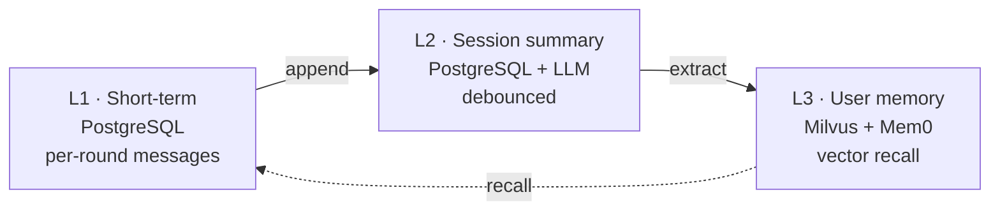

<p align="center">
  
</p>

<h1 align="center">thinkback</h1>

<p align="center">
  <strong>Memory service for conversation assistants</strong><br>
  会话助手的记忆内核 · Short-term context · Session summary · Cross-session recall
</p>

<p align="center">
  <a href="#quick-start--快速开始"></a>
  <a href="docs/report/ARCHITECTURE.md"></a>
  <a href="#license--许可证"></a>
</p>

<br/>

## Contents · 目录

- [Features · 特性](#features--特性)
- [Architecture · 架构](#architecture--架构)
- [Quick Start · 快速开始](#quick-start--快速开始)
- [Configuration · 配置](#configuration--配置)
- [Project Layout · 项目结构](#project-layout--项目结构)
- [Documentation · 文档](#documentation--文档)
- [License · 许可证](#license--许可证)

---

## Features · 特性

- **Three-layer memory** — short-term rounds → session summary → cross-session recall
- **PostgreSQL + Milvus dual-store** — durable rows in PG, vectors in Milvus
- **Mem0-orchestrated L3** — extraction, search, update, delete via Mem0
- **HTTP + gRPC dual protocol** — FastAPI and grpc share one implementation
- **Strictly typed** — Pydantic v2 + mypy strict end-to-end
- **OpenAI-compatible endpoints** — pluggable LLM and embedding URLs

---

## Architecture · 架构



Layers flow one-way; no cross-write. Mem0 owns L3 storage entirely.

---

## Quick Start · 快速开始

```bash
# 1. Local infra
make docker-up

# 2. Install + config
poetry install
cp .env.example .env  # fill OPENAI_API_KEY, MILVUS_URL, ...

# 3. Run + test
make run       # http://localhost:8000
make tests     # deterministic suite
```

Health: `curl http://localhost:8000/health/ready`

---

## Configuration · 配置

Core variables — see `.env.example` for full list.

| Variable | Purpose |
| --- | --- |
| `OPENAI_API_KEY` | LLM extraction key |
| `MEMORY_LLM_BASE_URL` | OpenAI-compatible LLM endpoint |
| `MEMORY_EMBEDDING_BASE_URL` | Embedding endpoint |
| `MEMORY_EMBEDDING_API_KEY` | Embedding key (空 if no auth) |
| `MILVUS_URL` | Vector store URL |
| `MEMORY_MILVUS_COLLECTION` | Collection name (L3) |
| `MEMORY_L3_WRITE_MODE` | `async` for background extraction |

---

## Project Layout · 项目结构

```
src/thinkback
├── domain        pure: enums, entities, port protocols, fingerprint keys
├── memory        app: orchestrator + use-cases
│   ├── service.py       MemoryService
│   ├── schemas.py       Pydantic API DTOs
│   ├── repositories/    in_memory + sqlalchemy
│   └── backends/        fake + mem0_library
├── infra         config · database · readiness · logging
├── api           FastAPI HTTP
└── rpc           gRPC
```

Dependency direction: `api/rpc → memory → infra → domain`. Domain depends on nothing else.

---

## Documentation · 文档

- [Architecture report](docs/report/ARCHITECTURE.md) — layers · components · data flow · API · schema
- [Three-layer memory design](docs/memory/) — design rationale
- [Admin dashboard](docs/admin/) — ops UI · gRPC server · real-tests · eval scripts
- [Debug report](docs/report/DEBUG_REPORT.md) — known edge cases
- [`.env.example`](.env.example) — full configuration reference

---

## License · 许可证

Internal use — Thinkback VPC.