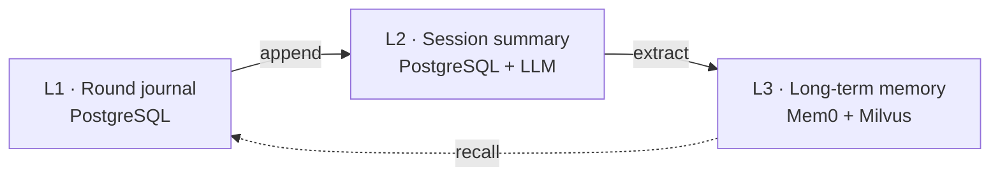

<div align="center">


**Self-hosted memory service for AI conversations**

Thinkback gives AI assistants and agents persistent memory across conversations. It keeps
short-term context, running session summaries, and long-term user facts as **three explicit
layers**, exposed through one idempotent HTTP/gRPC API — and it stays observable when
something fails.

Built on [Mem0](https://github.com/mem0ai/mem0) as its long-term memory engine, plus
PostgreSQL and Milvus.

<br>

[](LICENSE)
[](https://github.com/mcgrapeng/Thinkback/actions/workflows/ci.yml)
[](https://www.python.org/downloads/)
[](https://fastapi.tiangolo.com)
[](https://docs.astral.sh/ruff/)
[](https://mypy.readthedocs.io)

[English](README.md) · [中文](README.zh-CN.md) ·
[Docs](docs/ARCHITECTURE.md) ·
[Report Bug](https://github.com/mcgrapeng/Thinkback/issues) ·
[Request Feature](https://github.com/mcgrapeng/Thinkback/issues)

</div>

---

## Table of Contents

- [What is Thinkback](#what-is-thinkback)
- [Thinkback vs. wiring mem0 yourself](#thinkback-vs-wiring-mem0-yourself)
- [Memory model](#memory-model)
- [Capabilities](#capabilities)
- [Admin Dashboard](#admin-dashboard)
- [Quickstart](#quickstart)
- [API Reference](#api-reference)
- [Performance](#performance)
- [Configuration](#configuration)
- [Project Layout](#project-layout)
- [Extending](#extending)
- [Development](#development)
- [Documentation](#documentation)
- [Contributing](#contributing)
- [License](#license)

---

## What is Thinkback

Thinkback is a **memory service** — a running process your application calls over HTTP or
gRPC — not a library you embed and then have to operate yourself.

It sits one level above the memory engine. **Mem0 is one of its pluggable L3 backends**
(behind a `MemoryBackend` port), responsible for fact extraction and vector recall. Around
that engine, Thinkback owns everything else a production memory layer needs:

```text
   your app / agent
          │  HTTP  or  gRPC
          ▼
   ┌──────────────────────────────────────────────┐
   │  Thinkback  (the service)                    │
   │                                              │
   │   L1  round journal        PostgreSQL        │
   │   L2  session summary      PostgreSQL + LLM  │
   │   L3  long-term memory     ──────────────┐   │
   │                                          │   │
   │   + idempotent writes, task governance,  │   │
   │     scoped deletes, admin dashboard      │   │
   └──────────────────────────────────────────┼───┘
                                              ▼
                                    Mem0  ·  Milvus
                                    (L3 engine, swappable)
```

Two consequences worth stating up front:

- **Mem0 is not a competitor.** It is a dependency. Replacing it (or pinning a different
  version) does not touch Thinkback's API surface.
- **The comparison that matters** is "Thinkback vs. calling the mem0 SDK from your app
  directly" — that is the axis below.

## Thinkback vs. wiring mem0 yourself

Mem0 is an excellent memory engine. Using it directly gives you fact extraction and
semantic recall. It does not give you a service. If you call it straight from your app,
here is what you are still on the hook for:

| You would have to build | Thinkback provides |
| --- | --- |
| Session-level context (last-N rounds, running summary) | L1 journal + L2 debounced summaries in PostgreSQL |
| Exactly-once writes across retries and replays | `journal_id` fingerprints, idempotent `append` |
| Behaviour when the LLM / embedding / vector store is down | Explicit `degraded=True` + reasons — never a half-answer |
| Background extraction with backpressure | Async L3 queue with capacity limits, drain, orphan-task reclaim |
| An API to list / edit / delete long-term memories | Full management surface with scoped deletes and audit |
| Observability of what the memory layer did | Task state machine, retry counts, last error, admin dashboard |
| Safe, scoped deletion | `MEMORY` / `SESSION` / `ALL` scopes with tombstones |
| Schema and readiness for deployment | Alembic migrations, liveness/readiness probes, metrics |

If your use case is "one process, one user, no retries" — call mem0 directly. If you are
shipping a service that other teams depend on, this is the gap Thinkback fills.

## Memory model

Thinkback splits memory into three layers with strict ownership — layers flow one way and
**never cross-write**.

| Layer | Stores | Backed by | Refresh policy |
| --- | --- | --- | --- |
| **L1 — Round journal** | Each complete `user → assistant` round | PostgreSQL | Append-only, retain last *N* rounds |
| **L2 — Session summary** | Running context for the session | PostgreSQL + LLM | Debounced — one LLM call per *N* rounds |
| **L3 — Long-term memory** | Cross-session facts and preferences | Mem0 + Milvus | Background extraction, semantic recall |



## Capabilities

### Memory model

- **Three explicit layers** with no cross-write — Mem0 owns L3 storage entirely
- **Bitemporal validity** — `valid_at` / `invalid_at`; superseding a fact keeps history
  rather than overwriting it
- **Business index state machine** — `ACTIVE` / `DELETED` / `SUPERSEDED` / `SUPPRESSED`,
  decoupled from backend storage state
- **Decay sweeper** — aged, rarely-recalled long-tail memories are suppressed (unreachable,
  never deleted); recalling one strengthens it back. *Off by default.*

### Reliability

- **Idempotent writes** — `request_id` / `round_id` fingerprints make replays safe
- **Scoped deletes** — by memory, by session, or user-wide, with tombstones
- **Explicit degradation** — `degraded=True` plus `degradation_reasons`, so callers can
  tell a real answer from a degraded one
- **Background task governance** — state machine with optimistic locking, retry budgets,
  dead-lettering, and orphan-task reclaim on cold start

### Production surface

- **HTTP + gRPC** — one shared Pydantic schema, pick the protocol your client prefers
- **Strictly typed end-to-end** — Pydantic v2 + `mypy --strict`; no `Any` at API boundaries
- **OpenAI-compatible endpoints** — bring your own LLM and embedding URLs
- **Kubernetes-native** — liveness/readiness probes, Prometheus metrics, Alembic migrations
- **Deterministic test suite** — in-memory + fake Mem0 backends; CI needs no real services
- **Admin dashboard** — inspect and repair what the memory layer actually did

### Typical uses

- Conversation assistants with session-spanning memory
- Customer support bots recalling past tickets and preferences
- Multi-turn agents holding task context across tool calls and interruptions
- Self-hosted AI infrastructure that must keep data on-prem

## Admin Dashboard

A web UI for inspecting and repairing the memory layer — background task states with retry
counts and last error, per-user memory browsing with source back-links, governance actions,
and an audit trail.


*Task monitoring: every write / extract / rebuild is a state machine, with failures and
dead-letters surfaced instead of swallowed.*

## Quickstart

### 1. Start the service

```bash
git clone https://github.com/mcgrapeng/Thinkback.git
cd Thinkback

# install dependencies
uv sync --frozen --group dev

# start a local PostgreSQL (optional — point .env at your own instance instead)
make dev-up

# configure
cp .env.example .env   # fill in MEMORY_LLM_KEY, MILVUS_URL, LLM & embedding endpoints

# run the API
uv run uvicorn thinkback.api.app:app --host 0.0.0.0 --port 8000
```

Or run both the API and the admin web UI in one step (ports auto-fallback when busy):

```bash
make dev
```

Health check:

```bash
curl http://localhost:8000/health/ready
```

### 2. Write a memory round

`POST /memory/append` records one complete `user → assistant` round and triggers L1/L2
updates plus background L3 extraction.

```bash
curl -X POST http://localhost:8000/memory/append \
  -H "Content-Type: application/json" \
  -d '{
    "request_id": "req-001",
    "user_id": "alice",
    "session_id": "support-001",
    "round_id": "round-001",
    "source_timestamp": "2026-01-15T10:00:00Z",
    "messages": [
      {
        "message_id": "m1",
        "role": "user",
        "content": "I prefer dark mode and vim keybindings.",
        "timestamp": "2026-01-15T10:00:00Z"
      },
      {
        "message_id": "m2",
        "role": "assistant",
        "content": "Noted. I will remember that.",
        "timestamp": "2026-01-15T10:00:02Z"
      }
    ]
  }'
```

Response:

```json
{
  "status": "completed",
  "task_id": "task-abc123",
  "round_id": "round-001",
  "l3_events": []
}
```

### 3. Recall relevant memory

`POST /memory/recall` returns L1/L2/L3 hits, with an explicit degradation signal when a
layer is unavailable.

```bash
curl -X POST http://localhost:8000/memory/recall \
  -H "Content-Type: application/json" \
  -d '{
    "user_id": "alice",
    "session_id": "support-002",
    "query": "What UI preferences does this user have?",
    "l3_limit": 3
  }'
```

Response:

```json
{
  "status": "ok",
  "degraded": false,
  "degradation_reasons": [],
  "items": [
    {
      "layer": "L3",
      "content": "Prefers dark mode and vim keybindings.",
      "memory_id": "mem-42",
      "score": 0.87
    }
  ]
}
```

> Prefer Python? The request and response models are plain Pydantic v2 schemas in
> `thinkback.memory.schemas` — send them with `httpx`, or use the generated gRPC stubs
> under `thinkback.rpc`. A dedicated client SDK is on the roadmap.

## API Reference

| Method | Path | Description |
| --- | --- | --- |
| `POST` | `/memory/append` | Write one complete `user → assistant` round |
| `POST` | `/memory/recall` | Recall L1/L2/L3 memory for a query |
| `POST` | `/memory/delete` | Delete by memory / session / user scope |
| `GET` | `/memory/items` | List manageable long-term memories for a user |
| `GET` | `/memory/items/{memory_id}` | Fetch one long-term memory |
| `POST` | `/memory/update` | Edit one ACTIVE long-term memory |
| `GET` | `/memory/tasks/{task_id}` | Poll a background write/delete/rebuild task |
| `GET` | `/memory/l3/background-status` | L3 background queue depth and capacity |
| `GET` | `/health` · `/health/live` · `/health/ready` | Liveness and readiness probes |
| `GET` | `/health/metrics` | Prometheus metrics |
| `GET` | `/admin/api/overview` · `/admin/api/tasks` · … | Admin dashboard endpoints |
| — | gRPC `MemoryService` (`proto/memory.proto`) | Append / Recall / Delete / List / Get / Update / Rebuild / GetTask |

Interactive OpenAPI docs are served at `/docs` when the API is running.

## Performance

Measured on the deterministic in-memory path (no network, no vector DB) — useful as a
baseline for the orchestration overhead, **not** as a production SLA:

| Path | n | p50 | p95 |
| --- | --- | --- | --- |
| `append` | 50 | 0.31 ms | 0.42 ms |
| `recall` | 50 | 0.17 ms | 0.28 ms |

Throughput on that path: **~2,180 ops/s**.

With a real L3 backend (Mem0 + Milvus + embedding calls) p95 lands roughly in the
**50–200 ms** band depending on your network and model endpoints — those numbers still
need to be measured against your own deployment. Details and the full production-readiness
checklist live in the
the [architecture report](docs/ARCHITECTURE.md).

## Configuration

Configuration is via environment variables. See [`.env.example`](.env.example) for the
full annotated list.

| Variable | Purpose |
| --- | --- |
| `MEMORY_LLM_KEY` | LLM API key (optional — leave empty if unauthenticated) |
| `OPENAI_API_KEY` | Legacy shared key; fallback when `MEMORY_LLM_KEY` is unset |
| `MEMORY_LLM_BASE_URL` | OpenAI-compatible LLM endpoint |
| `MEMORY_LLM_MODEL` | LLM model name |
| `MEMORY_EMBEDDING_BASE_URL` | OpenAI-compatible embedding endpoint |
| `MEMORY_EMBEDDING_API_KEY` | Embedding key (optional — leave empty if unauthenticated) |
| `MEMORY_EMBEDDING_MODEL` | Embedding model name |
| `MEMORY_EMBEDDING_DIMS` | Embedding dimension (must match the model) |
| `MILVUS_URL` | Vector store URL |
| `MILVUS_USER` / `MILVUS_PASSWORD` | Milvus credentials (leave empty if unauthenticated) |
| `DATABASE_URL` | PostgreSQL connection string (L1/L2 + business index) |
| `MEMORY_MILVUS_COLLECTION` | Milvus collection name (L3) |
| `GRPC_PORT` | gRPC server port (default `50052`) |

## Project Layout

```text
src/thinkback
├── domain        pure: enums, entities, port protocols, fingerprint keys
├── memory        app: orchestrator + use-cases
│   ├── service.py        MemoryService
│   ├── schemas.py        Pydantic API DTOs
│   ├── repositories/     in_memory + sqlalchemy   (L1/L2 + business index)
│   └── backends/         fake + mem0_library      (L3 engine)
├── infra         config · database · readiness · logging
├── api           FastAPI HTTP
└── rpc           gRPC
```

Dependency direction: `api/rpc → memory → infra → domain`. The `domain` package depends on
nothing else.

## Extending

The L3 engine is behind a port, not hard-wired:

| Port | Implementations | Purpose |
| --- | --- | --- |
| `MemoryBackend` | `fake` (tests) · `mem0_library` (production) | Long-term fact storage and semantic recall |
| `MemoryRepository` | `in_memory` (tests) · `sqlalchemy` (production) | L1 journal, L2 summaries, business index, tasks |
| `HistorySource` | — | History replay for rebuilds |

Swapping or upgrading Mem0 is a change behind `MemoryBackend`. Adding another engine means
implementing the same four methods (`add` / `search` / `update` / `delete`), with no change
to the HTTP/gRPC surface.

## Development

```bash
make dev           # API + admin web UI (ports auto-fallback)
make test          # deterministic test suite
make check         # format-check + ruff + mypy strict + coverage
make lint          # ruff
make typecheck     # mypy --strict
make fmt           # ruff format
make hooks-install # install pre-commit hooks
```

The deterministic suite runs entirely offline — in-memory repositories and a fake Mem0
backend stand in for PostgreSQL, Milvus, and LLM calls. See
[CONTRIBUTING.md](CONTRIBUTING.md) for the full workflow.

## Documentation

| Document | Contents |
| --- | --- |
| [Architecture Report](docs/ARCHITECTURE.md) | Layers, components, data flow, API, DB schema |
| [Three-Layer Memory Design](docs/memory/) | Design rationale and layer boundaries |
| [gRPC Guide](docs/GRPC.md) | Proto definitions and service usage |
| [Admin Dashboard](docs/admin/) | Ops UI, background tasks, evaluation scripts |
| [Architecture Report](docs/ARCHITECTURE.md) | Known edge cases and their resolutions |
| [`.env.example`](.env.example) | Full configuration reference |

## Contributing

We welcome issues and pull requests of all sizes. Please read
[CONTRIBUTING.md](CONTRIBUTING.md) for setup instructions and PR guidelines.

## License

Apache License 2.0 — see [LICENSE](LICENSE) for details.

---

<div align="center">

<sub>Built for teams who need a self-hosted, observable, type-safe memory service.</sub>

</div>
