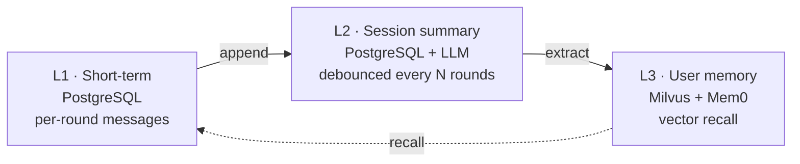

<div align="center">


# thinkback

**Memory Layer for Personalized AI Conversations**

thinkback gives AI assistants and agents intelligent, persistent memory across conversations. It remembers user preferences, learns from past interactions, and recalls relevant context when needed — enabling personalized AI that improves over time.

Built on a **three-layer memory architecture** with PostgreSQL, Milvus, and Mem0.

<br>

[](LICENSE)
[](pyproject.toml)
[](https://fastapi.tiangolo.com)
[](https://mem0.ai)
[](https://docs.astral.sh/ruff/)
[](https://mypy.readthedocs.io)

[English](README.md) · [中文](README.zh-CN.md) · [Report Bug](https://github.com/your-org/thinkback/issues) · [Request Feature](https://github.com/your-org/thinkback/issues)

</div>

---

## ✨ Features

### 🧠 Three-Layer Memory Architecture

thinkback organizes memory into three distinct layers, each optimized for its role:

- **L1 — Short-term context** — per-round messages in PostgreSQL; append-only, last-N rounds
- **L2 — Session summary** — per-session context with LLM-debounced refresh; one LLM call per N rounds
- **L3 — User memory** — cross-session facts in Milvus vectors via Mem0; semantic recall across newly created sessions

Layers flow one-way; **no cross-write** — Mem0 owns L3 storage entirely. Read [Architecture Report](docs/report/ARCHITECTURE.md) for full details.

### ⚡ Production-Ready

- **HTTP + gRPC dual protocol** — FastAPI and grpc share one Pydantic schema; pick the protocol your client prefers
- **Strictly typed end-to-end** — Pydantic v2 + mypy strict; no `Any` at the API boundary
- **OpenAI-compatible endpoints** — bring your own LLM/embedding URLs; works with any `/v1`-compatible API (OpenAI, DashScope, vLLM, etc.)
- **Kubernetes-native** — health, liveness, readiness probes; orphan-task recovery on cold start
- **Deterministic test suite** — in-memory + Mem0-fake backends; integration + 5-round pressure scenarios

### 🎯 Use Cases

- **Conversation assistants** — context-rich, stateful chat with session-spanning memory
- **Customer support bots** — recall past tickets, user preferences, and historical context
- **Multi-turn agents** — long-horizon task memory across tool calls and interruptions
- **Multi-session personalization** — user memory carries into newly created sessions
- **Self-hosted AI infrastructure** — fully on-prem, no external LLM call required

## 📦 Installation

```bash
pip install thinkback
```

Or with [Poetry](https://python-poetry.org):

```bash
poetry add thinkback
```

Or built from source (Self-Hosted Service):

```bash
git clone https://github.com/your-org/thinkback.git
cd thinkback
poetry install
```

### Requirements

- Python 3.12+
- PostgreSQL 14+
- Milvus 2.x
- OpenAI-compatible LLM endpoint (OpenAI, DashScope, vLLM, etc.)
- OpenAI-compatible embedding endpoint

## 🚀 Quick Start

Use the Python client SDK against an existing thinkback service:

```python
from thinkback import MemoryClient

client = MemoryClient()  # reads THINKBACK_URL from env

# Add a memory from a conversation
client.add(
    messages=[
        {"role": "user", "content": "I prefer dark mode and vim keybindings."},
        {"role": "assistant", "content": "Noted. I'll remember that."},
    ],
    user_id="alice",
    session_id="support-001",
)

# Recall relevant memories
memories = client.search(
    query="What does Alice prefer?",
    user_id="alice",
    top_k=3,
)
for m in memories.results:
    print(f"- {m['memory']}")
```

### Run the Service Yourself

```bash
# Start local dependencies (PostgreSQL + Milvus)
make docker-up

# Configure
cp .env.example .env  # fill in OPENAI_API_KEY, MILVUS_URL, ...

# Run + test
make run        # http://localhost:8000
make tests      # deterministic suite
make real-tests # 5-round pressure against real Mem0 + Milvus + LLM
```

Health check: `curl http://localhost:8000/health/ready`

## 🏗️ Architecture



Read the full [Architecture Report](docs/report/ARCHITECTURE.md) for layers, components, data flow, API design, and DB schema.

## ⚙️ Configuration

Configuration is via environment variables. See [`.env.example`](.env.example) for the full list with notes.

| Variable | Purpose |
| --- | --- |
| `OPENAI_API_KEY` | LLM extraction key |
| `MEMORY_LLM_BASE_URL` | OpenAI-compatible LLM endpoint |
| `MEMORY_LLM_MODEL` | LLM model name |
| `MEMORY_EMBEDDING_BASE_URL` | Embedding endpoint |
| `MEMORY_EMBEDDING_API_KEY` | Embedding key (空 if no auth) |
| `MEMORY_EMBEDDING_MODEL` | Embedding model name |
| `MILVUS_URL` | Vector store URL |
| `MILVUS_USER` / `MILVUS_PASSWORD` | Milvus credentials (空 if no auth) |
| `POSTGRES_HOST` / `POSTGRES_PORT` | PostgreSQL host and port |
| `MEMORY_MILVUS_COLLECTION` | Collection name (L3) |
| `MEMORY_L3_WRITE_MODE` | `async` for background extraction |

## 📁 Project Layout

```
src/thinkback
├── domain        pure: enums, entities, port protocols, fingerprint keys
├── memory        app: orchestrator + use-cases
│   ├── service.py       MemoryService
│   ├── schemas.py       Pydantic API DTOs
│   ├── repositories/    in_memory + sqlalchemy
│   └── backends/        fake + mem0_library
├── infra         config · database · readiness · logging
├── api           FastAPI HTTP
└── rpc           gRPC
```

Dependency direction: `api/rpc → memory → infra → domain`. Domain depends on nothing else.

## 🧪 Development

```bash
make tests         # deterministic test suite
make real-tests    # 5-round pressure (needs real Mem0 + Milvus + LLM)
make lint          # ruff
make typecheck     # mypy strict
make fmt           # ruff format
```

## 🤝 Contributing

We welcome issues and pull requests. See [CONTRIBUTING.md](CONTRIBUTING.md) for guidelines.

## 📚 Documentation

- [Architecture Report](docs/report/ARCHITECTURE.md) — layers, components, data flow, API, schema
- [Three-Layer Memory Design](docs/memory/) — design rationale and boundary
- [Admin Dashboard](docs/admin/) — ops UI, gRPC server, real-tests, eval scripts
- [Debug Report](docs/report/DEBUG_REPORT.md) — known edge cases and resolutions
- [`.env.example`](.env.example) — full configuration reference

## 📜 License

Apache License 2.0 — see [LICENSE](LICENSE) for details.

## 🙏 Acknowledgments

- [Mem0](https://mem0.ai) — the memory layer underneath
- [Milvus](https://milvus.io) — the vector database
- [FastAPI](https://fastapi.tiangolo.com) — the HTTP framework
- [Pydantic](https://docs.pydantic.dev) — the data validation backbone
- [uv](https://github.com/astral-sh/uv) — the package manager

---

<sub>Built for AI infrastructure teams who need a self-hosted, observable, type-safe memory service.</sub>