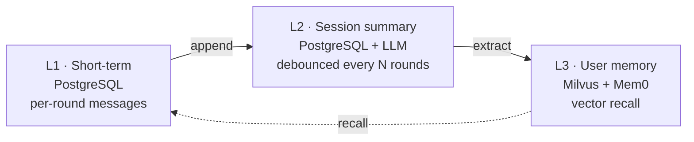

<p align="center">
  <a href="docs/report/ARCHITECTURE.md">
    
  </a>
</p>

<p align="center">
  <a href="docs/report/ARCHITECTURE.md"></a>
  <a href="docs/admin/"></a>
  <a href="#license"></a>
  <a href="#quickstart"></a>
</p>

<p align="center">
  <a href="docs/report/ARCHITECTURE.md">📚 Documentation</a>
  ·
  <a href="docs/admin/">🎛️ Admin Dashboard</a>
  ·
  <a href="docs/memory/">🧠 Memory Design</a>
  ·
  <a href="#quickstart">🚀 Quickstart</a>
</p>

<br/>

# thinkback

**thinkback** is the memory layer for conversation assistants. It stores per-session short-term context in PostgreSQL, maintains an LLM-debounced session summary, and extracts user-level long-term memory that can be recalled across newly created sessions via Mem0 + Milvus.

Built for production: HTTP + gRPC dual protocol, OpenAI-compatible LLM/embedding endpoints, Kubernetes-native health probes, Pydantic v2 + mypy strict.

## Key Features & Use Cases

**Memory Architecture**

- **Three-layer memory model** — short-term rounds → session summary → cross-session recall, with one-way data flow between layers
- **PostgreSQL + Milvus dual-store** — durable rows in PG, vectors in Milvus; each layer picks the right store
- **Mem0-orchestrated L3** — extraction, semantic search, update, and delete unified through Mem0 Library
- **Decay & governance** — idle memories are suppressed (not deleted) with audit trail; protected critical facts are immune

**Production-grade**

- **HTTP + gRPC dual protocol** — FastAPI and grpc share one Pydantic schema; pick the protocol your client prefers
- **Strictly typed end-to-end** — Pydantic v2 + mypy strict; no `Any` at the API boundary
- **OpenAI-compatible LLM/embedding endpoints** — bring your own URL and model name; works with any `/v1` OpenAI-compatible API
- **Kubernetes-native** — health, liveness, and readiness probes; orphan-task recovery on cold start
- **Deterministic test suite** — in-memory + Mem0-fake backends; integration + 5-round pressure scenarios

**Applications**

- **Conversation assistants** — context-rich, stateful chat with session-spanning memory
- **Customer support bots** — recall past tickets, user preferences, and historical context
- **Multi-turn agents** — long-horizon task memory across tool calls and interruptions
- **Multi-session personalization** — user memory carries into newly created sessions
- **Self-hosted AI infrastructure** — fully on-prem, no external LLM call required

## 🚀 Quickstart Guide

### Local Development

```bash
# 1. Start local infra (PostgreSQL + Milvus)
make docker-up

# 2. Install + configure
poetry install
cp .env.example .env  # fill OPENAI_API_KEY, MILVUS_URL, ...

# 3. Run + test
make run        # http://localhost:8000
make tests      # deterministic suite
```

### Docker Stack (everything in one command)

```bash
docker compose up   # PostgreSQL + Milvus + thinkback service
```

### Kubernetes Deployment

```bash
make k8s-apply      # apply manifests in k8s/
```

### Health Check

```bash
curl http://localhost:8000/health
curl http://localhost:8000/health/live
curl http://localhost:8000/health/ready
```

### Real LLM Pressure Test (optional)

```bash
make docker-up
make real-tests     # 5-round pressure against real Mem0 + Milvus + LLM
```

## 🏗️ Architecture



Three layers, one-way flow; **Mem0 owns L3 storage entirely** — the service never bypasses Mem0 to write Milvus directly. See [Architecture report](docs/report/ARCHITECTURE.md) for layers, components, data flow, API design, and DB schema.

## ⚙️ Configuration

Core variables — see [`.env.example`](.env.example) for the full list with notes.

| Variable | Purpose |
| --- | --- |
| `OPENAI_API_KEY` | LLM extraction key |
| `MEMORY_LLM_BASE_URL` | OpenAI-compatible LLM endpoint |
| `MEMORY_EMBEDDING_BASE_URL` | Embedding endpoint |
| `MEMORY_EMBEDDING_API_KEY` | Embedding key (空 if no auth) |
| `MILVUS_URL` | Vector store URL |
| `MILVUS_USER` / `MILVUS_PASSWORD` | Milvus credentials (空 if no auth) |
| `MEMORY_MILVUS_COLLECTION` | Collection name (L3) |
| `MEMORY_L3_WRITE_MODE` | `async` for background extraction |
| `POSTGRES_*` | PostgreSQL host/port/user/password/database |

## 📁 Project Layout

```
src/thinkback
├── domain        pure: enums, entities, port protocols, fingerprint keys
├── memory        app: orchestrator + use-cases
│   ├── service.py       MemoryService
│   ├── schemas.py       Pydantic API DTOs
│   ├── repositories/    in_memory + sqlalchemy
│   └── backends/        fake + mem0_library
├── infra         config · database · readiness · logging
├── api           FastAPI HTTP
└── rpc           gRPC
```

Dependency direction: `api/rpc → memory → infra → domain`. Domain depends on nothing else.

## 📚 Documentation & Support

- [Architecture report](docs/report/ARCHITECTURE.md) — layers · components · data flow · API · schema
- [Three-layer memory design](docs/memory/) — design rationale · boundary · scope
- [Admin dashboard](docs/admin/) — ops UI · gRPC server · real-tests · eval scripts
- [Debug report](docs/report/DEBUG_REPORT.md) — known edge cases and resolutions
- [`.env.example`](.env.example) — full configuration reference

## ⚖️ License

Internal use — Thinkback VPC. Not for public distribution.