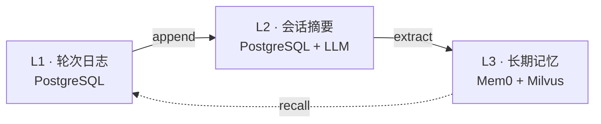
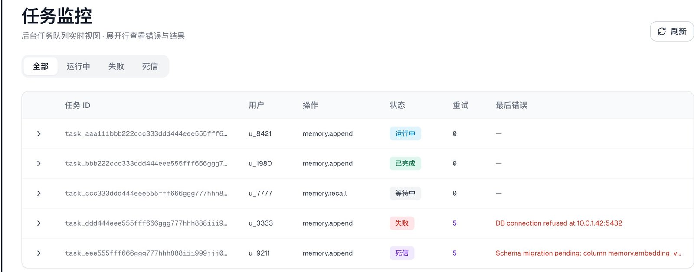

<div align="center">


# Thinkback

**面向 AI 会话的自托管记忆服务 · Self-hosted memory service for AI conversations**

Thinkback 让 AI 助手与智能体拥有跨会话的持久记忆。它把短期上下文、会话摘要与长期用户事实
组织成**三层显式记忆**，通过一套幂等的 HTTP / gRPC API 暴露 —— 并且在出问题时保持可观测。

长期记忆引擎基于 [Mem0](https://github.com/mem0ai/mem0) 构建，外加 PostgreSQL 与 Milvus。

<br>

[](LICENSE)
[](https://github.com/mcgrapeng/Thinkback/actions/workflows/ci.yml)
[](https://www.python.org/downloads/)
[](https://fastapi.tiangolo.com)
[](https://docs.astral.sh/ruff/)
[](https://mypy.readthedocs.io)

[English](README.md) · [中文](README.zh-CN.md) ·
[文档](docs/report/ARCHITECTURE.md) ·
[报告问题](https://github.com/mcgrapeng/Thinkback/issues) ·
[功能请求](https://github.com/mcgrapeng/Thinkback/issues)

</div>

---

## 目录

- [Thinkback 是什么](#thinkback-是什么)
- [Thinkback vs. 自己拼 mem0](#thinkback-vs-自己拼-mem0)
- [记忆模型](#记忆模型)
- [能力](#能力)
- [管理台](#管理台)
- [快速开始](#快速开始)
- [API 参考](#api-参考)
- [性能](#性能)
- [配置](#配置)
- [项目结构](#项目结构)
- [扩展](#扩展)
- [开发](#开发)
- [文档](#文档)
- [贡献](#贡献)
- [许可证](#许可证)

---

## Thinkback 是什么

Thinkback 是一个**记忆服务** —— 一个你的应用通过 HTTP 或 gRPC 调用的常驻进程，
不是一个内嵌进你进程、运维还得自己扛的库。

它位于记忆引擎的上一层。**Mem0 是它可插拔的 L3 后端之一**（封装在 `MemoryBackend`
端口之后），负责事实抽取与向量召回。引擎之外，生产级记忆层所需的其余一切由 Thinkback 负责：

```text
   你的应用 / 智能体
          │  HTTP  或  gRPC
          ▼
   ┌──────────────────────────────────────────────┐
   │  Thinkback  （服务本身）                       │
   │                                              │
   │   L1  轮次日志           PostgreSQL           │
   │   L2  会话摘要           PostgreSQL + LLM     │
   │   L3  长期记忆           ──────────────┐      │
   │                                       │      │
   │   + 幂等写入、任务治理、               │      │
   │     范围删除、管理台                   │      │
   └───────────────────────────────────────┼──────┘
                                           ▼
                                  Mem0  ·  Milvus
                                  （L3 引擎，可替换）
```

两点必须先说清楚：

- **Mem0 不是竞品，是依赖。** 换掉它（或钉住不同版本）不会触及 Thinkback 的 API 面。
- **真正有意义的对比**是「Thinkback vs. 直接在应用里调 mem0 SDK」—— 下面就是这条轴。

## Thinkback vs. 自己拼 mem0

Mem0 是优秀的记忆引擎。直接用它，你能拿到事实抽取与语义召回。但它不是一个服务。
如果你直接从应用里调它，下面这些仍然要你自己扛：

| 你得自己造 | Thinkback 提供 |
| --- | --- |
| 会话级上下文（最近 N 轮、滚动摘要） | L1 轮次日志 + L2 去抖摘要，落 PostgreSQL |
| 重试与重放下的恰好一次写入 | `journal_id` 指纹，幂等 `append` |
| LLM / embedding / 向量库挂了怎么办 | 显式 `degraded=True` + 原因列表 —— 绝不返回半真半假 |
| 带背压的后台抽取 | 异步 L3 队列：容量上限、drain、孤儿任务回收 |
| 列出 / 编辑 / 删除长期记忆的 API | 完整管理面，含范围删除与审计 |
| 可观测「记忆层到底做了什么」 | 任务状态机、重试次数、最后错误、管理台 |
| 安全的范围删除 | `MEMORY` / `SESSION` / `ALL` 三种范围 + 墓碑 |
| 部署所需的 schema 与就绪检查 | Alembic 迁移、liveness/readiness 探针、指标 |

如果你的场景是「单进程、单用户、无重试」—— 直接调 mem0 就够了。
如果你在交付一个别的团队要依赖的服务，这正是 Thinkback 补上的缺口。

## 记忆模型

Thinkback 把记忆拆成三层，所有权严格隔离 —— 层级单向流动，**禁止跨层写入**。

| 层 | 存什么 | 支撑 | 刷新策略 |
| --- | --- | --- | --- |
| **L1 — 轮次日志** | 每一轮完整的 `user → assistant` | PostgreSQL | append-only，保留最近 *N* 轮 |
| **L2 — 会话摘要** | 会话内的滚动上下文 | PostgreSQL + LLM | 去抖 —— 每 *N* 轮一次 LLM 调用 |
| **L3 — 长期记忆** | 跨会话事实与偏好 | Mem0 + Milvus | 后台抽取，语义召回 |



## 能力

### 记忆模型

- **三层显式分层**，禁止跨层写入 —— Mem0 完全拥有 L3 存储
- **双时态有效性** —— `valid_at` / `invalid_at`；取代事实时保留历史而非覆盖
- **业务索引状态机** —— `ACTIVE` / `DELETED` / `SUPERSEDED` / `SUPPRESSED`，
  与后端存储状态解耦
- **衰减清扫** —— 老化且久未召回的长尾记忆被抑制（不可达、绝不删除）；
  一旦被召回即强化回满强度。*默认关闭*

### 可靠性

- **幂等写入** —— `request_id` / `round_id` 指纹让重放安全
- **范围删除** —— 按记忆、按会话或按用户全局，带墓碑
- **显式降级** —— `degraded=True` 加 `degradation_reasons`，
  调用方能区分真实答案与降级答案
- **后台任务治理** —— 状态机 + 乐观锁 + 重试预算 + 死信，冷启动回收孤儿任务

### 生产面

- **HTTP + gRPC** —— 共享一份 Pydantic schema，按客户端偏好选协议
- **端到端严格类型** —— Pydantic v2 + `mypy --strict`；API 边界不出现 `Any`
- **OpenAI 兼容端点** —— 自带 LLM 与 Embedding URL
- **Kubernetes 原生** —— liveness/readiness 探针、Prometheus 指标、Alembic 迁移
- **确定性测试套件** —— 内存仓储 + fake Mem0 后端；CI 不依赖真实服务
- **管理台** —— 检视并修复记忆层的真实行为

### 典型用途

- 跨会话记忆的会话助手
- 召回历史工单与偏好的客服机器人
- 跨工具调用与中断保持任务上下文的多轮智能体
- 必须数据内网落地的自托管 AI 基础设施

## 管理台

一个 Web 界面，用来检视并修复记忆层 —— 后台任务状态（含重试次数与最后错误）、
按用户浏览记忆并回溯来源、治理操作、审计日志。



*任务监控：每一次写入 / 抽取 / 重建都是一台状态机，失败与死信被显式抛出而非吞掉。*

## 快速开始

### 1. 启动服务

```bash
git clone https://github.com/mcgrapeng/Thinkback.git
cd Thinkback

# 安装依赖
uv sync --frozen --group dev

# 启动本地 PostgreSQL（可选 —— 也可以在 .env 里指向你自己的实例）
make dev-up

# 配置
cp .env.example .env   # 填写 MEMORY_LLM_KEY、MILVUS_URL、LLM 与 Embedding 端点

# 运行 API
uv run uvicorn thinkback.api.app:app --host 0.0.0.0 --port 8000
```

或一条命令同时启动 API 与管理台前端（端口占用自动顺延）：

```bash
make dev
```

健康检查：

```bash
curl http://localhost:8000/health/ready
```

### 2. 写入一轮记忆

`POST /memory/append` 记录一轮完整的 `user → assistant` 对话，并触发
L1/L2 更新与 L3 后台抽取。

```bash
curl -X POST http://localhost:8000/memory/append \
  -H "Content-Type: application/json" \
  -d '{
    "request_id": "req-001",
    "user_id": "alice",
    "session_id": "support-001",
    "round_id": "round-001",
    "source_timestamp": "2026-01-15T10:00:00Z",
    "messages": [
      {
        "message_id": "m1",
        "role": "user",
        "content": "我偏好深色主题和 vim 键位。",
        "timestamp": "2026-01-15T10:00:00Z"
      },
      {
        "message_id": "m2",
        "role": "assistant",
        "content": "已记录，我会记住。",
        "timestamp": "2026-01-15T10:00:02Z"
      }
    ]
  }'
```

响应：

```json
{
  "status": "completed",
  "task_id": "task-abc123",
  "round_id": "round-001",
  "l3_events": []
}
```

### 3. 召回相关记忆

`POST /memory/recall` 返回 L1/L2/L3 命中结果；当某层不可用时显式给出降级信号。

```bash
curl -X POST http://localhost:8000/memory/recall \
  -H "Content-Type: application/json" \
  -d '{
    "user_id": "alice",
    "session_id": "support-002",
    "query": "这个用户有哪些界面偏好？",
    "l3_limit": 3
  }'
```

响应：

```json
{
  "status": "ok",
  "degraded": false,
  "degradation_reasons": [],
  "items": [
    {
      "layer": "L3",
      "content": "偏好深色主题与 vim 键位。",
      "memory_id": "mem-42",
      "score": 0.87
    }
  ]
}
```

> 想用 Python？请求与响应模型就是 `thinkback.memory.schemas` 里的普通 Pydantic v2 schema，
> 可直接用 `httpx` 发送，或使用 `thinkback.rpc` 下生成的 gRPC stub。
> 专用客户端 SDK 已列入路线图。

## API 参考

| 方法 | 路径 | 说明 |
| --- | --- | --- |
| `POST` | `/memory/append` | 写入一轮完整的 `user → assistant` 对话 |
| `POST` | `/memory/recall` | 按查询召回 L1/L2/L3 记忆 |
| `POST` | `/memory/delete` | 按 memory / session / 用户全局范围删除 |
| `GET` | `/memory/items` | 列出该用户的可管理长期记忆 |
| `GET` | `/memory/items/{memory_id}` | 查询单条长期记忆 |
| `POST` | `/memory/update` | 编辑单条 ACTIVE 长期记忆 |
| `GET` | `/memory/tasks/{task_id}` | 查询后台写入/删除/重建任务 |
| `GET` | `/memory/l3/background-status` | L3 后台队列深度与剩余容量 |
| `GET` | `/health` · `/health/live` · `/health/ready` | 存活与就绪探针 |
| `GET` | `/health/metrics` | Prometheus 指标 |
| `GET` | `/admin/api/overview` · `/admin/api/tasks` · … | 管理台端点 |
| — | gRPC `MemoryService`（`proto/memory.proto`） | Append / Recall / Delete / List / Get / Update / Rebuild / GetTask |

API 运行后，交互式 OpenAPI 文档位于 `/docs`。

## 性能

以下数据测自确定性 in-memory 路径（无网络、无向量库）—— 只反映编排开销基线，
**不是**生产 SLA：

| 路径 | n | p50 | p95 |
| --- | --- | --- | --- |
| `append` | 50 | 0.31 ms | 0.42 ms |
| `recall` | 50 | 0.17 ms | 0.28 ms |

该路径吞吐：**约 2,180 ops/s**。

接入真实 L3 后端（Mem0 + Milvus + embedding 调用）时，p95 大致落在
**50–200 ms** 区间，取决于你的网络与模型端点 —— 这些数字仍需在你的部署上实测。
细节与完整生产就绪清单见
[生产就绪报告](docs/memory/report/2026-09-30_thinkback_production_readiness.md)。

## 配置

通过环境变量配置。完整带注释列表见 [`.env.example`](.env.example)。

| 变量 | 用途 |
| --- | --- |
| `MEMORY_LLM_KEY` | LLM API key（可选 —— 无鉴权时留空） |
| `OPENAI_API_KEY` | 兼容旧部署的共享 key；`MEMORY_LLM_KEY` 未设置时的回退 |
| `MEMORY_LLM_BASE_URL` | OpenAI 兼容 LLM 端点 |
| `MEMORY_LLM_MODEL` | LLM 模型名 |
| `MEMORY_EMBEDDING_BASE_URL` | OpenAI 兼容 Embedding 端点 |
| `MEMORY_EMBEDDING_API_KEY` | Embedding key（可选 —— 无鉴权时留空） |
| `MEMORY_EMBEDDING_MODEL` | Embedding 模型名 |
| `MEMORY_EMBEDDING_DIMS` | Embedding 维度（须与模型一致） |
| `MILVUS_URL` | 向量库 URL |
| `MILVUS_USER` / `MILVUS_PASSWORD` | Milvus 凭证（无鉴权时留空） |
| `DATABASE_URL` | PostgreSQL 连接串（L1/L2 + 业务索引） |
| `MEMORY_MILVUS_COLLECTION` | Milvus collection 名（L3） |
| `GRPC_PORT` | gRPC 服务端口（默认 `50052`） |

## 项目结构

```text
src/thinkback
├── domain        纯领域层：枚举 / 实体 / 端口协议 / 指纹键
├── memory        应用层：编排与用例
│   ├── service.py        MemoryService
│   ├── schemas.py        Pydantic API DTO
│   ├── repositories/     in_memory + sqlalchemy  （L1/L2 + 业务索引）
│   └── backends/         fake + mem0_library     （L3 引擎）
├── infra         配置 · 数据库 · readiness · 日志
├── api           FastAPI HTTP
└── rpc           gRPC
```

依赖方向：`api/rpc → memory → infra → domain`，`domain` 不依赖任何其他层。

## 扩展

L3 引擎封装在端口之后，并未硬绑：

| 端口 | 实现 | 用途 |
| --- | --- | --- |
| `MemoryBackend` | `fake`（测试）· `mem0_library`（生产） | 长期事实存储与语义召回 |
| `MemoryRepository` | `in_memory`（测试）· `sqlalchemy`（生产） | L1 日志、L2 摘要、业务索引、任务 |
| `HistorySource` | — | 重建时的历史回放 |

替换或升级 Mem0 是 `MemoryBackend` 背后的改动。接入另一个引擎只需实现同样的四个方法
（`add` / `search` / `update` / `delete`），HTTP / gRPC 面完全不变。

## 开发

```bash
make dev           # API + 管理台前端（端口占用自动顺延）
make test          # 确定性测试套件
make check         # 格式检查 + ruff + mypy strict + 覆盖率
make lint          # ruff
make typecheck     # mypy --strict
make fmt           # ruff 格式化
make hooks-install # 安装 pre-commit 钩子
```

确定性测试完全离线运行 —— 内存仓储与 fake Mem0 后端顶替 PostgreSQL、Milvus 与 LLM 调用。
完整流程见 [CONTRIBUTING.md](CONTRIBUTING.md)。

## 文档

| 文档 | 内容 |
| --- | --- |
| [架构报告](docs/report/ARCHITECTURE.md) | 层级、组件、数据流、API、数据库 schema |
| [三层记忆设计](docs/memory/) | 设计理念与层级边界 |
| [gRPC 指南](docs/report/GRPC.md) | Proto 定义与服务用法 |
| [管理台](docs/admin/) | 运维界面、后台任务、评测脚本 |
| [调试报告](docs/report/DEBUG_REPORT.md) | 已知边界情况与处理方式 |
| [`.env.example`](.env.example) | 完整配置参考 |

## 贡献

欢迎各种规模的 Issue 与 Pull Request。环境搭建与 PR 规范见
[CONTRIBUTING.md](CONTRIBUTING.md)。

## 许可证

Apache License 2.0 —— 详见 [LICENSE](LICENSE)。

---

<div align="center">

<sub>为需要自托管、可观测、强类型记忆服务的团队而构建。</sub>

</div>
