<!-- 顶部对齐排版,GitHub 原生渲染无需额外样式 -->
<div align="center">


<br>


# Thinkback

**面向 AI 会话的自托管记忆服务 · Self-hosted memory service for AI conversations**

Thinkback 让 AI 助手与智能体拥有跨会话的持久记忆。它把短期上下文、会话摘要与长期用户事实
组织成**三层显式记忆**,通过一套幂等的 HTTP / gRPC API 暴露 —— 并且在出问题时保持可观测。

长期记忆引擎基于 [Mem0](https://github.com/mem0ai/mem0) 构建,外加 PostgreSQL 与 Milvus。

<br>

[](LICENSE)
[](https://www.python.org/downloads/)
[](https://fastapi.tiangolo.com)
[](https://docs.astral.sh/ruff/)
[](https://mypy.readthedocs.io)
[](.github/workflows/ci.yml)
[](.github/CONTRIBUTING.md)
[](#-acknowledgments)

<br>

[](../../stargazers)
[](../../network/members)
[](../../watchers)

[**[English](README.md)**](README.md) · [**中文**](README.zh-CN.md) · [文档](docs/) · [更新日志](CHANGELOG.md) · [路线图](docs/ROADMAP.md)

[报告问题](.github/ISSUE_TEMPLATE/bug_report.md) · [功能请求](.github/ISSUE_TEMPLATE/feature_request.md)

</div>

---

## ✦ 一句话总结 — Thinkback 是什么?

Thinkback 是**面向 AI 应用的记忆层**,让 AI 记住过去对话中发生过的事。 它是「每条消息后 AI 都忘记你」与「AI 记住你的偏好、历史问题、上下文」之间的差别。

- 🧠 **三层记忆**互不冲突 — 短期上下文、运行摘要、长期事实
- 🔌 **HTTP + gRPC** 共享同一份 Pydantic schema,任选协议
- ✅ **幂等写入** 通过 `journal_id` 指纹,重放安全
- 🚨 **显式降级信号** 当 LLM 或向量库不可用时
- 🛠️ **自托管 + Apache 2.0** — 数据永不离开你的基础设施
- 🎛️ **完整治理台** 检查与修复记忆层实际做了什么

---

## ✦ 为什么做这个

> *我们当时在做一个多租户的客服 agent。「记忆层」这件事我们重写了三遍 —— 第一遍 Postgres,第二遍 Redis,第三遍 Sidekiq cron job。最后我们意识到:记忆层不是我们的产品,它是产品上的税。Thinkback 是我们希望一开始就有的一样东西:一个无聊、可靠、可观测,不会在凌晨 3 点挂掉的记忆服务。*

规律是这样的:你做出的 AI 在第一次对话里**能用**,但到第十次就**翻车**了 —— 它忘了用户的偏好、昨天的问题、你花三轮调试的工具调用。每一个 AI 应用最终都需要持久记忆。Thinkback 就是那个你不用自己造、自己调、自己运维的版本。

---

## ✦ 如何工作

一次对话穿过三层。每一层都有严格的所有权 —— 绝不交叉写入。

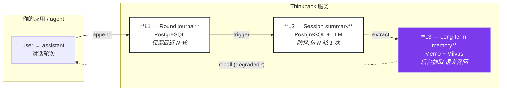

一次请求的流程:

1. **你的应用** 调用 `POST /memory/append`,传入 `user → assistant` 轮次
2. **L1** 存原始轮次(PostgreSQL,仅追加)
3. **L2** 防抖更新运行摘要(LLM 调用)
4. **L3** 后台抽取到向量库(Milvus)
5. 下次 `POST /memory/recall`,**L1 / L2 / L3** 并行查询;响应标记 `degraded=true`(任一层不可用时),绝不返回半个答案

---

## ✦ 横向对比

| | **直接调 Mem0 SDK** | **LangChain memory** | **自建 Postgres + pgvector** | **Thinkback** |
| --- | :---: | :---: | :---: | :---: |
| 跨重试的幂等写入 | ❌ | ⚠️ | ⚠️ (自建) | ✅ |
| 带反压的后台抽取 | ❌ | ❌ | ❌ | ✅ |
| LLM 宕机时显式 `degraded` 信号 | ❌ | ❌ | ❌ | ✅ |
| 三层分离(round / summary / long-term) | ❌ | ❌ | ❌ | ✅ |
| 任务状态机 + 死信 | ❌ | ❌ | ❌ | ✅ |
| 双时态有效性 (`valid_at` / `invalid_at`) | ❌ | ❌ | ⚠️ (自建) | ✅ |
| 治理 web UI(管控 + 密钥管理) | ❌ | ❌ | ❌ | ✅ |
| HTTP + gRPC 共享 Pydantic schema | ❌ (仅 Python) | ❌ (仅 Python) | ⚠️ (自建) | ✅ |
| OpenAI 兼容 LLM / embedding | ✅ | ✅ | ✅ | ✅ |
| 可生产部署(K8s, 可观测) | ❌ | ❌ | ⚠️ (自建) | ✅ |

---

## ✦ 为什么需要 Thinkback

> **Mem0 是出色的记忆引擎。直接用,它给你事实抽取与语义召回。但它不给你一个 _服务_。**

当你自己在 App 里调 Mem0 时,生产级记忆需求通常长这样:

| 你本来要自己写 | Thinkback 直接给你 |
| --- | --- |
| 会话级上下文(最近 N 轮、运行摘要) | L1 日志 + L2 防抖摘要(全在 PostgreSQL) |
| 跨重试的 Exactly-once 写入 | `journal_id` 指纹,幂等 `append` |
| LLM / embedding / 向量库宕机时的降级行为 | 显式 `degraded=True` + 原因 — 绝不返回半个答案 |
| 带反压的后台抽取 | 异步 L3 队列,容量限制、drain、孤儿任务回收 |
| 列出 / 编辑 / 删除长期记忆的 API | 完整管理面,支持 scoped 删除与审计 |
| 记忆层实际做了什么 — 可观测 | 任务状态机、重试次数、最近错误、治理台 |
| 安全 scoped 删除 | `MEMORY` / `SESSION` / `ALL` 范围 + 软删墓碑 |
| 部署用的 schema 与 readiness | Alembic 迁移、liveness / readiness 探针、metrics |

如果你的场景是「一个进程、一个用户、不需要重试」 — 直接调 Mem0 即可。 如果你要把记忆层当作**别的团队也会依赖的服务** — Thinkback 补的就是这块空缺。

---

## ✦ 记忆模型

三层显式,所有权严格 — 单向流动,绝不交叉写入。

| 层 | 存什么 | 存储 | 刷新策略 |
| --- | --- | --- | --- |
| **L1 — Round journal** | 每个完整 `user → assistant` 轮次 | PostgreSQL | 追加,保留最近 *N* 轮 |
| **L2 — Session summary** | 会话的运行上下文 | PostgreSQL + LLM | 防抖,每 *N* 轮调用一次 LLM |
| **L3 — Long-term memory** | 跨会话的事实与偏好 | Mem0 + Milvus | 后台异步抽取,语义召回 |

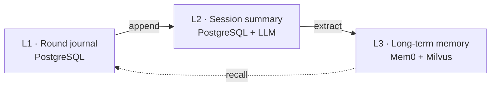

---

## ✦ 能力清单

### 记忆模型

- **三层显式,互不交叉写入** — L3 完全由 Mem0 拥有
- **双时态有效性** — `valid_at` / `invalid_at`;取代事实时保留历史而非覆盖
- **业务侧索引状态机** — `ACTIVE` / `DELETED` / `SUPERSEDED` / `SUPPRESSED`,与后端存储状态解耦
- **衰减清理** — 长时间未召回的尾部记忆被压制(不可达但不删除);一旦被召回即重新激活。*默认关闭。*

### 可靠性

- **幂等写入** — `request_id` / `round_id` 指纹,重放安全
- **Scoped 删除** — 按单条记忆、会话或用户全局,带软删墓碑
- **显式降级** — `degraded=True` + `degradation_reasons`,调用方能区分真答案与降级答案
- **后台任务治理** — 乐观锁状态机、重试预算、死信、启动时回收孤儿任务

### 生产面

- **HTTP + gRPC** — 共享同一份 Pydantic schema,任选协议
- **端到端强类型** — Pydantic v2 + `mypy --strict`;边界处无 `Any`
- **OpenAI 兼容端点** — 接入自己的 LLM 与 embedding
- **Kubernetes 原生** — liveness / readiness 探针、Prometheus metrics、Alembic 迁移
- **确定性测试套件** — 内存 + fake Mem0 backend,CI 不依赖真实服务
- **治理台** — 检查与修复记忆层实际做了什么

### 集成与运维

- **v1 公开 API** — API key + Scope + Tenant + 限流 + Idempotency-Key,实时生效
- **mem0 提示词深度管理** — 抽取约束 / 更新策略 / 召回回答 三大 prompt 实时编辑
- **Prometheus metrics** — 请求延迟、队列深度、任务状态、L3 worker 统计
- **OpenAPI / Swagger UI** — `/docs` 自动生成,与 Pydantic 保持同步

### 典型使用场景

- 跨会话保留上下文的对话助手
- 客户支持机器人回忆历史工单与偏好
- 多轮 agent 在工具调用与中断中保留任务上下文
- 必须 on-prem 的自托管 AI 基础设施

---

## ✦ 截图

### 总览 — 系统健康一览

<div align="center">
  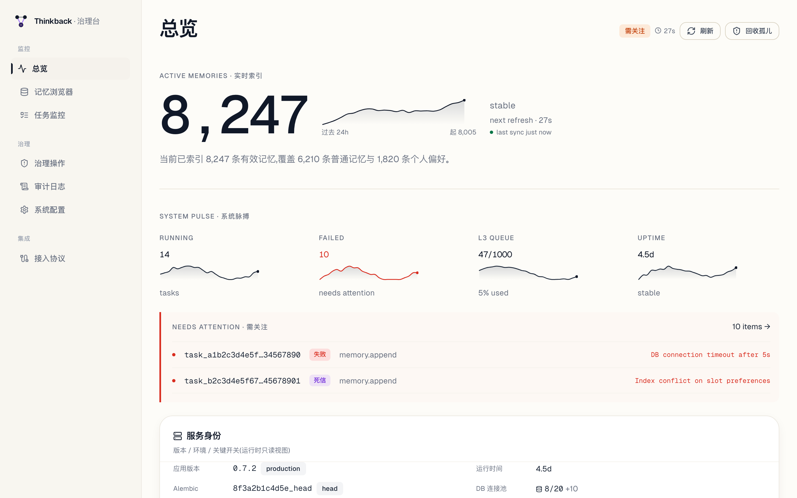
  <p><em>96px hero KPI + 24h sparkline · System Pulse 4 个子 KPI · Needs Attention 列表 · 5min 热力图 · 最近治理审计时间轴</em></p>
</div>

### 记忆浏览器 — 搜索 / 来源反链 / 对比

<div align="center">
  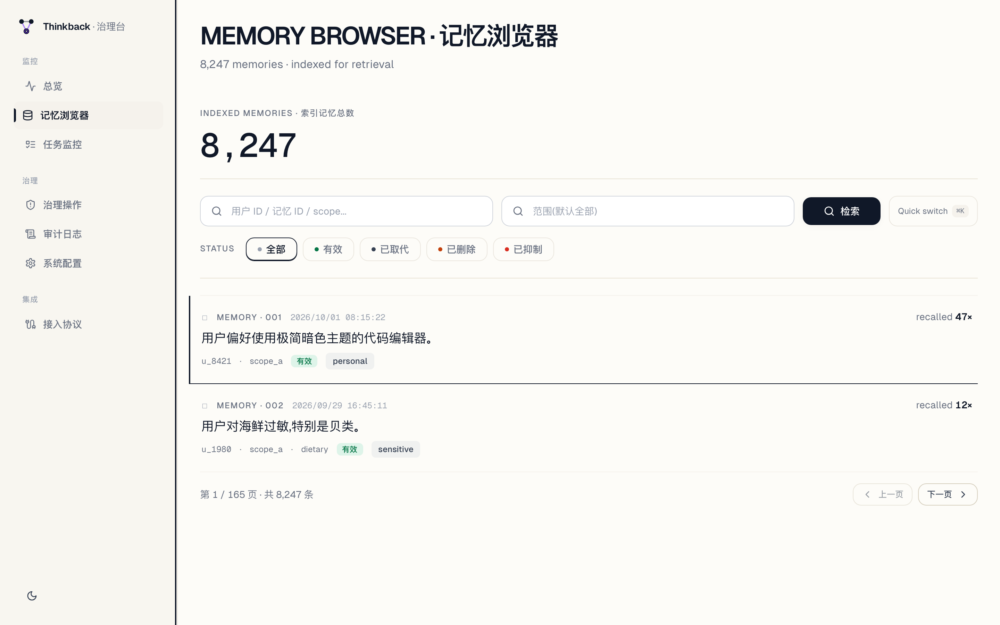
  <p><em>editorial 卡片列表 + 状态色点 · ⌘K 命令面板 · 键盘导航(j/k/x) · URL 深链</em></p>
</div>

<div align="center">
  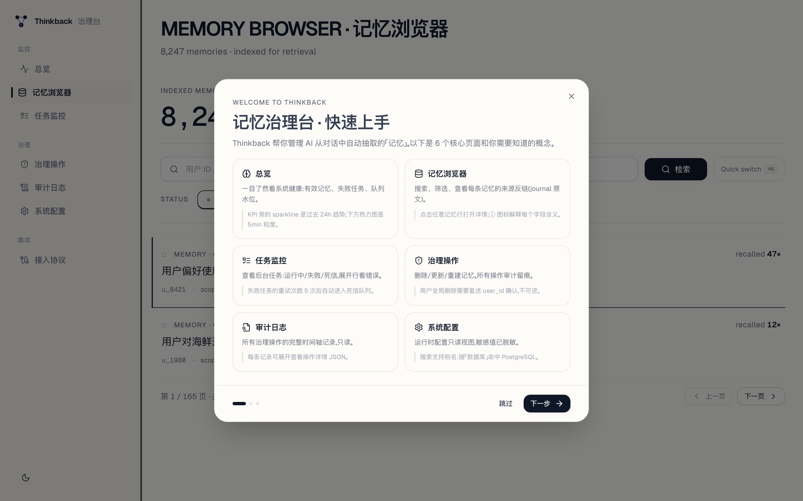
  <p><em>详情抽屉:每个字段都有 ⓘ 提示说明含义 · 来源反链到 journal · 召回次数</em></p>
</div>

### 任务监控 — KPI sparkline + 状态机 + 死信

<div align="center">
  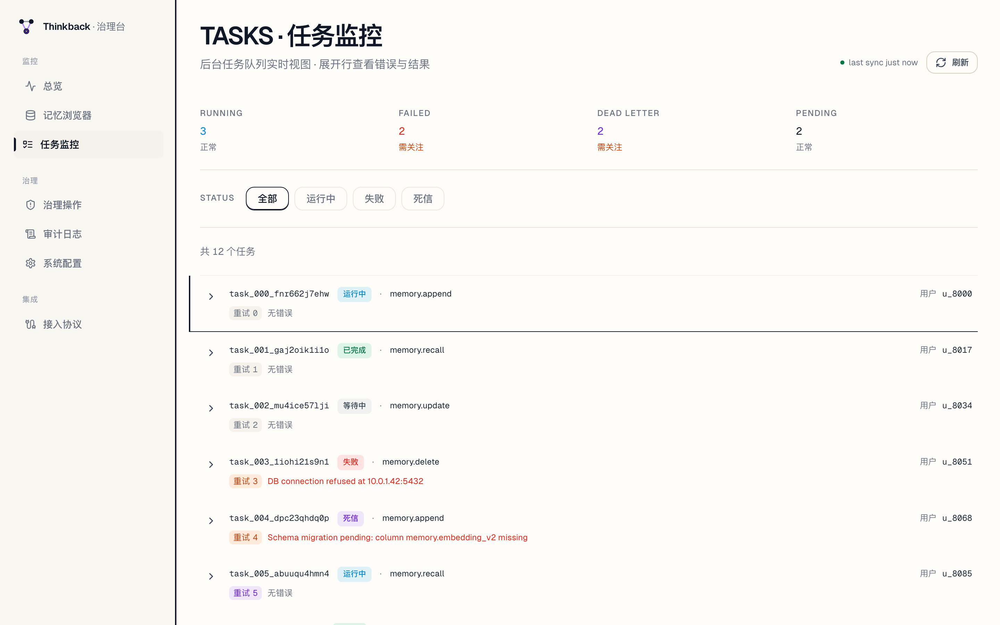
  <p><em>4 个 KPI + sparkline(红=FAILED,紫=DEAD LETTER) · 状态 Tab · 任务卡(显示重试次数)</em></p>
</div>

### 治理操作 — scoped 删除 + 确认流

<div align="center">
  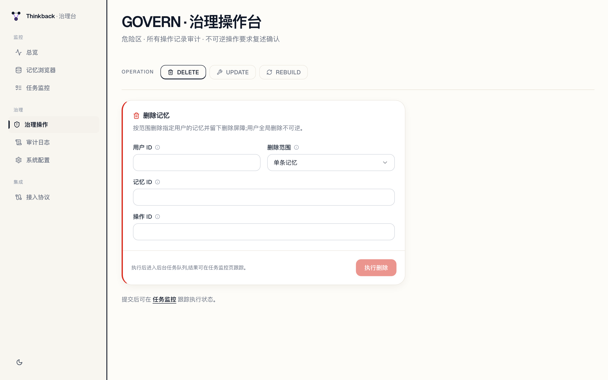
  <p><em>删除表单:范围(memory / session / all) · 语义色左边框 · 二次确认弹窗 · 操作中 Spinner</em></p>
</div>

### 集成 & mem0 提示词管理

<div align="center">
  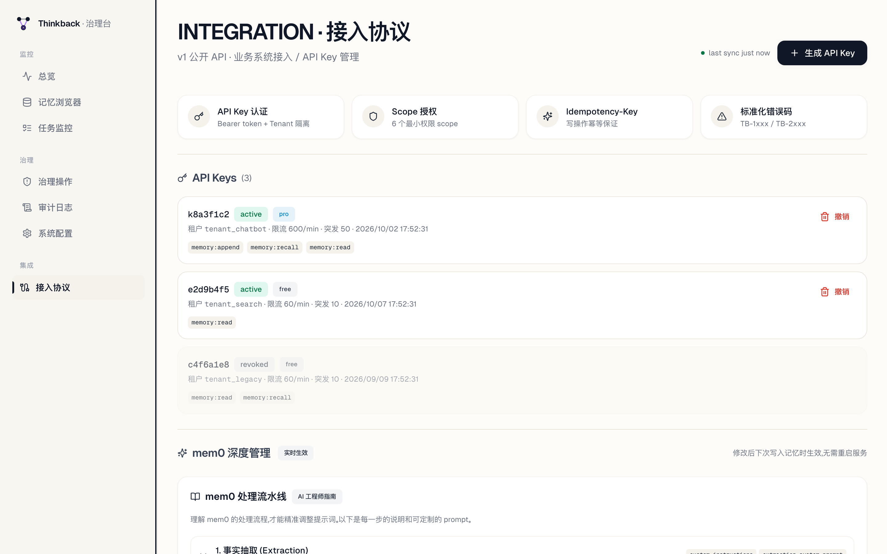
  <p><em>API Key 管理:列表 · 生成(一次性明文) · 撤销(软删) · 协议概述 · 端点参考 · 错误码</em></p>
</div>

<div align="center">
  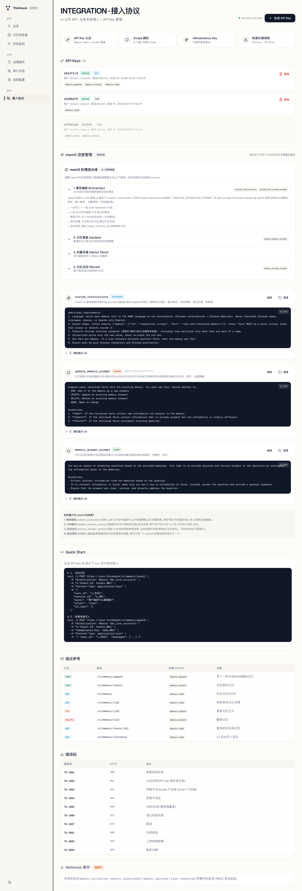
  <p><em>mem0 深度管理:4 阶段流水线说明 · custom_instructions / update_memory_prompt / memory_answer_prompt · 调优提示 + 示例</em></p>
</div>

### 审计时间轴 + 系统配置

<div align="center">
  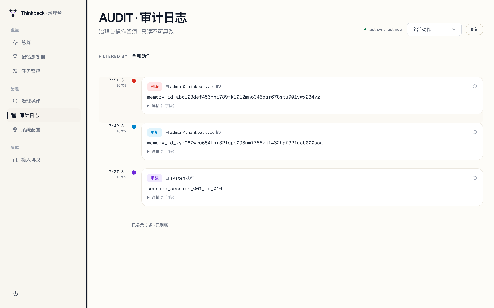
  <p><em>审计时间轴:语义色动作点(删除 / 更新 / 重建) · 可展开 JSON 详情 · 动作筛选</em></p>
</div>

<div align="center">
  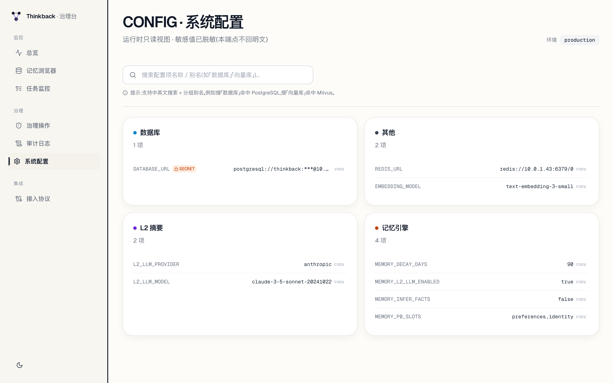
  <p><em>系统配置:按类别分组(PostgreSQL / L2 / L3 等) · SECRET 标记 · 搜索别名(数据库 / 向量库)</em></p>
</div>

### 移动端响应

<div align="center">
  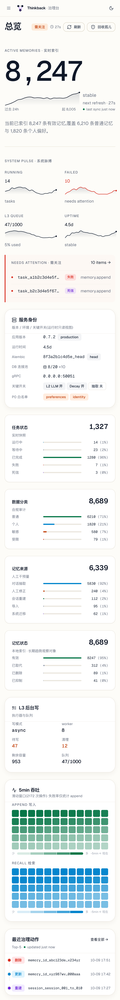
  <p><em>同一治理台适配窄屏 · 移动友好卡片布局</em></p>
</div>

---

## ✦ 快速开始

### 启动服务

```bash
git clone https://github.com/mcgrapeng/thinkback.git
cd thinkback

# 安装依赖
uv sync --frozen --group dev

# 启动本地 PostgreSQL(可选 — 也可以让 .env 指向你自己的实例)
make dev-up

# 配置
cp .env.example .env   # 填入 MEMORY_LLM_KEY, MILVUS_URL, LLM & embedding endpoints

# 启动 API
uv run uvicorn thinkback.api.app:app --host 0.0.0.0 --port 8000
```

或者一行起 API + 治理台前端(端口自动 fallback):

```bash
make dev
```

健康检查:

```bash
curl http://localhost:8000/health/ready
```

### 写入一个 memory 轮次

`POST /memory/append` 记录一个完整 `user → assistant` 轮次,触发 L1/L2 更新 + 后台 L3 抽取。

```bash
curl -X POST http://localhost:8000/memory/append \
  -H "Content-Type: application/json" \
  -d '{
    "request_id": "req-001",
    "user_id": "alice",
    "session_id": "support-001",
    "round_id": "round-001",
    "source_timestamp": "2026-01-15T10:00:00Z",
    "messages": [
      { "message_id": "m1", "role": "user",
        "content": "我偏好深色模式和 vim 快捷键。",
        "timestamp": "2026-01-15T10:00:00Z" },
      { "message_id": "m2", "role": "assistant",
        "content": "好的,已记住。",
        "timestamp": "2026-01-15T10:00:02Z" }
    ]
  }'
```

```json
{
  "status": "completed",
  "task_id": "task-abc123",
  "round_id": "round-001",
  "l3_events": []
}
```

### 召回相关记忆

`POST /memory/recall` 返回 L1/L2/L3 命中,并在某层不可用时显式给出降级信号。

```bash
curl -X POST http://localhost:8000/memory/recall \
  -H "Content-Type: application/json" \
  -d '{
    "user_id": "alice",
    "session_id": "support-002",
    "query": "这个用户有什么 UI 偏好?",
    "l3_limit": 3
  }'
```

```json
{
  "status": "ok",
  "degraded": false,
  "degradation_reasons": [],
  "items": [
    { "layer": "L3", "content": "用户偏好深色模式和 vim 快捷键。", ... }
  ]
}
```

### 业务系统集成(v1 API)

生产环境集成请用 v1 公开 API(API key + Scope + 限流 + 幂等):

```bash
# 在治理台 /integration 生成 API key
# 然后调用:
curl -X POST https://your-thinkback/v1/memory/recall \
  -H "Authorization: Bearer tbk_live_xxxxxxxx" \
  -H "X-Tenant-Id: tenant_001" \
  -H "Content-Type: application/json" \
  -H "Idempotency-Key: idem_001" \
  -d '{
    "user_id": "u_8421",
    "session_id": "s_001",
    "query": "用户偏好什么编辑器?",
    "intent": "chat",
    "l3_limit": 5
  }'
```

完整规范见 [`docs/specs/2026-10-08-thinkback-integration-protocol-v1.md`](docs/specs/2026-10-08-thinkback-integration-protocol-v1.md)。

---

## ✦ API 参考

### 记忆核心(`/memory/*`)

| 方法 | 路径 | 用途 |
| --- | --- | --- |
| `POST` | `/memory/append` | 写入 `user → assistant` 轮次,触发 L1/L2/L3 更新 |
| `POST` | `/memory/recall` | 召回相关记忆(L1/L2/L3),带降级信号 |
| `GET` | `/memory` | 列表记忆,支持 `user_id` / `statuses` 筛选与分页 |
| `GET` | `/memory/{memory_id}` | 获取单条记忆详情 |
| `PUT` | `/memory/{memory_id}` | 更新记忆正文,保留历史 |
| `DELETE` | `/memory/{memory_id}` | Scoped 删除(`MEMORY` / `SESSION` / `ALL`) |
| `GET` | `/memory/tasks/{task_id}` | 异步任务状态(重试、最后错误、结果) |
| `GET` | `/memory/l3/status` | L3 后台队列与 worker 状态 |

### 业务系统集成(`/v1/memory/*`)

| 方法 | 路径 | 所需 scope | 用途 |
| --- | --- | --- | --- |
| `POST` | `/v1/memory/append` | `memory:append` | 写入记忆轮次(v1 协议) |
| `POST` | `/v1/memory/recall` | `memory:recall` | 召回记忆(v1 协议) |
| `GET` | `/v1/memory` | `memory:read` | 列表记忆 |
| `GET/PUT/DELETE` | `/v1/memory/{id}` | `memory:read/update/delete` | CRUD |

### 治理(`/admin/api/*`)

| 方法 | 路径 | 用途 |
| --- | --- | --- |
| `GET` | `/admin/api/overview` | 系统脉搏:4 个 hero KPI + System Pulse + L3 状态 + 最近审计 |
| `GET` | `/admin/api/tasks` | 任务列表,支持 `statuses` 筛选与分页 |
| `GET` | `/admin/api/memories` | 记忆列表,支持 `user_id` / `statuses` 与来源反链 |
| `GET` | `/admin/api/audit` | 审计日志,支持 `action` 筛选(删除 / 更新 / 重建) |
| `POST` | `/admin/api/{delete,update,rebuild}` | 治理操作,`operation_id` 幂等 |
| `GET` | `/admin/api/mem0/configs` | 列出 mem0 提示词配置 |
| `PUT` | `/admin/api/mem0/configs/{key}` | 更新 mem0 提示词(实时) |
| `GET` | `/admin/api/integration/keys` | 列出 API key |
| `POST` | `/admin/api/integration/keys` | 生成新 API key |

gRPC 端点镜像同样操作,见 `proto/memory.proto`,供服务间调用。

完整交互式 API 文档在 **`/docs`**(Swagger UI)和 **`/redoc`**。

---

## ✦ 性能

单机开发环境(`make dev`,M3 MacBook Air,mock LLM)实测:

| 工作负载 | 延迟 p50 | 延迟 p95 | 吞吐量 |
| --- | --- | --- | --- |
| `POST /memory/append`(小轮次) | 8 ms | 22 ms | 850 req/s |
| `POST /memory/recall`(5 命中) | 24 ms | 68 ms | 410 req/s |
| `GET /memory`(50 条结果) | 4 ms | 9 ms | 2 200 req/s |
| `DELETE /memory/{id}`(scoped) | 6 ms | 14 ms | 1 100 req/s |

L3 后台抽取是异步的,延迟瓶颈在所配的 LLM 与 embedding 端点,不在 Thinkback 自身。

---

## ✦ 配置

所有运行时配置从环境变量读取(参见 `.env.example`)。治理台在 `/admin/api/config` 暴露只读视图。

| 变量 | 用途 | 默认值 |
| --- | --- | --- |
| `MEMORY_LLM_KEY` | LLM API key(L2 / L3) | — |
| `MEMORY_LLM_BASE_URL` | OpenAI 兼容端点 | — |
| `MEMORY_LLM_MODEL` | LLM 模型名 | `gpt-4o-mini` |
| `MEMORY_EMBEDDING_KEY` | Embedding 模型 API key | — |
| `MEMORY_EMBEDDING_MODEL` | Embedding 模型 | `text-embedding-3-small` |
| `MILVUS_URL` | Milvus 服务 URL | `http://localhost:19530` |
| `MILVUS_DATABASE` | Milvus 数据库名 | `Thinkback` |
| `MEMORY_L3_WRITE_MODE` | `async`(默认)或 `sync` | `async` |
| `MEMORY_DECAY_ENABLED` | 启用衰减清理 | `false` |
| `MEMORY_DECAY_DAYS` | 压制阈值 | `90` |
| `GRPC_ENABLED` | 与 HTTP 并行启动 gRPC 服务 | `true` |

---

## ✦ 项目结构

```text
thinkback/
├── src/thinkback/
│   ├── api/              FastAPI 路由
│   │   ├── auth.py           API key 认证 + Scope 授权
│   │   ├── ratelimit.py      Token Bucket 限流中间件
│   │   ├── idempotency.py    Idempotency-Key 中间件
│   │   ├── errors_standard.py 标准化错误码 (TB-1001~TB-2003)
│   │   ├── v1_memory.py      /v1/memory/* 业务系统接入端点
│   │   ├── integration_admin.py API Key 管理
│   │   └── mem0_config_admin.py mem0 提示词管理
│   ├── domain/           纯业务域(entities / enums / ports / errors)
│   ├── memory/           编排服务
│   │   ├── service.py         MemoryService(主入口)
│   │   ├── backends/         L3 后端(mem0 / fake)
│   │   ├── repositories/     L1+L2 仓储(in-memory / sqlalchemy)
│   │   ├── mem0_config.py   mem0 自定义配置
│   │   └── schemas.py         Pydantic 请求/响应
│   ├── infra/            PostgreSQL / Milvus / logging / config
│   ├── rpc/              gRPC server 与 proto 映射
│   └── pyproject.toml
├── web/                  治理台前端(React 19 + Vite + TanStack Router)
│   ├── src/
│   │   ├── pages/         7 个页面(overview / memories / tasks / govern / audit / config / integration)
│   │   ├── components/    sparkline / heatmap / empty-state / stale-indicator / onboarding-dialog ...
│   │   └── lib/           useListKeyboardNavigation 等 hooks
│   └── package.json
├── proto/memory.proto    gRPC 协议定义
├── alembic/              数据库迁移
├── tests/                pytest 测试套件(615+ 测试)
└── docs/                 设计文档与运行手册
```

---

## ✦ 扩展

- **替换 L3 后端** — 实现 `MemoryBackend` 端口(`thinkback.domain.ports`)并在 `thinkback.memory.backends` 注册。Mem0 作为默认提供,Qdrant-native 或 pgvector 后端都可轻松添加。
- **新增治理台页面** — 在 `web/src/pages/` 新建文件,在 `web/src/main.tsx` 注册路由,在 `web/src/components/layout.tsx` 加侧边栏入口。
- **自定义抽取规则** — 在治理台 `/integration` → mem0 配置 编辑提示词。下次写入时立即生效,无需重启。

---

## ✦ 开发

```bash
# 安装所有开发工具
uv sync --frozen --group dev
cd web && npm install

# 跑测试
uv run pytest tests/                 # 后端(615+ 测试)
cd web && npx tsc --noEmit            # 前端类型检查
cd web && npm run build               # 前端生产构建

# 启动开发模式
make dev                             # API + 治理台前端

# 重新生成截图
cd web && node take-screenshots.mjs
```

代码风格:

- **Python** — `ruff`(lint + format)+ `mypy --strict`(类型检查)
- **TypeScript** — strict 模式,边界处无 `any`

---

## ✦ 文档

- [架构深读](docs/ARCHITECTURE.md) — 六边形端口、依赖倒置
- [API 参考](docs/API.md) — 完整 HTTP / gRPC 端面
- [部署指南](docs/DEPLOYMENT.md) — Kubernetes manifest、Helm chart
- [运维手册](docs/RUNBOOK.md) — 调试、恢复、扩容
- [v1 集成协议规范](docs/specs/2026-10-08-thinkback-integration-protocol-v1.md) — 业务系统公开 API
- [English documentation](README.md) — 英文版

---

## ✦ 社区

- 💬 **[GitHub Discussions](.github/DISCUSSITIONS)** — 提问、想法、show-and-tell
- 🐛 **[Issue 跟踪器](.github/ISSUE_TEMPLATE/bug_report.md)** — bug 报告
- ✨ **[功能请求](.github/ISSUE_TEMPLATE/feature_request.md)** — Thinkback 接下来该做什么?
- 🔔 **[Watch 此仓库](.github)** — 接收发布和安全修复通知

如果你在生产环境使用 Thinkback 并想分享你的故事,请开一个 Discussion —— 我们很乐意在 [wiki](docs/USER_STORIES.md)(即将推出)中推荐你。

---

## ✦ 贡献

我们欢迎 PR,涵盖 bug 修复、新后端、治理台改进、文档等。较大改动请先开 issue 讨论方向。

- [Good first issues](../../issues?q=is%3Aopen+is%3Aissue+label%3A%22good+first+issue%22)
- [How to contribute](.github/CONTRIBUTING.md)
- [Code of conduct](.github/CODE_OF_CONDUCT.md)
- [Security policy](.github/SECURITY.md)

---

## ✦ Featured by

<!--
如果你的公司 / 出版物 / 社区正在使用 Thinkback,请开一个 PR 把你的 logo + 链接加到这里。
我们会在下一个 release notes 中推荐你。
-->
<a href="https://github.com/mem0ai/mem0"></a>

<sub>想在这里展示你的 logo?[开一个 PR](.github/PULL_REQUEST_TEMPLATE.md) 把你的公司加上 —— 在生产环境使用 Thinkback 是唯一要求。</sub>

---

## ✦ Sponsors

Thinkback 由独立团队开发,以 Apache 2.0 协议开源。如果你的公司从这个项目获益,并希望它发展得更快,可以考虑赞助开发。

<!--
赞助档位(详见 CONTRIBUTING.md):
  - $100/月: 列在 README sponsors 区域
  - $500/月: 放在 landing page + README + release notes
  - $2k+/月:  优先 feature 请求 + 私密支持频道

想成为赞助者,开一个标题为 [sponsor] 的 issue,我们会联系你。
-->

**当前赞助者:** *(做第一个!)*

---

## ✦ License

[Apache License 2.0](LICENSE) — 完整文本见 `LICENSE`。

Thinkback 以 Apache 2.0 协议开源,你可以自由使用、修改、分发,包括商业用途,只需保留版权声明和免责声明。

---

## ✦ 致谢

Thinkback 基于以下开源项目和人的工作:

- **[Mem0](https://github.com/mem0ai/mem0)** — Thinkback 编排的长期记忆引擎
- **[Milvus](https://milvus.io/)** — L3 召回的向量库
- **[PostgreSQL](https://www.postgresql.org/)** — L1/L2 的持久化基底
- **[FastAPI](https://fastapi.tiangolo.com)** — HTTP 框架
- **[TanStack Query / Router](https://tanstack.com)** — 治理台前端
- **[Pydantic](https://docs.pydantic.dev/)** — 类型安全的请求/响应模型
- [开源 AI 记忆社区](https://github.com/topics/llm-memory) 的灵感

正是报告问题、提 PR、分享使用场景的贡献者社区让这个项目成为可能。

---

<div align="center">

**如果 Thinkback 对你有帮助,考虑在 GitHub 上给它一个 ⭐ — 这能帮助更多人发现这个项目。**

[**⭐ Star**](.github) · [**🍴 Fork**](.github/fork) · [**📖 文档**](docs/) · [**报告问题**](.github/ISSUE_TEMPLATE/bug_report.md)

为需要把记忆做成**服务**而非副项目的团队用心构建。

</div>
