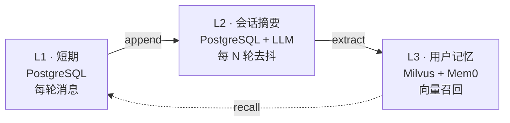

<div align="center">


# thinkback

**会话助手的记忆内核 · Memory Layer for Personalized AI Conversations**

thinkback 为 AI 助手与智能体提供跨会话的智能、持久记忆。它记住用户偏好，从历史交互中学习，并在需要时召回归相关上下文 — 让 AI 真正个性化、随时间进化。

基于**三层记忆架构**构建，PostgreSQL + Milvus + Mem0 支撑。

<br>

[](LICENSE)
[](pyproject.toml)
[](https://fastapi.tiangolo.com)
[](https://mem0.ai)
[](https://docs.astral.sh/ruff/)
[](https://mypy.readthedocs.io)

[English](README.md) · [中文](README.zh-CN.md) · [报告问题](https://github.com/your-org/thinkback/issues) · [功能请求](https://github.com/your-org/thinkback/issues)

</div>

---

## ✨ 特性

### 🧠 三层记忆架构

thinkback 将记忆组织成三层，每层针对其角色优化：

- **L1 — 短期上下文** — PostgreSQL 中的每轮消息；append-only，保留最近 N 轮
- **L2 — 会话摘要** — 每会话上下文，LLM 去抖刷新；每 N 轮触发一次 LLM 调用
- **L3 — 用户记忆** — Milvus 向量（经 Mem0）；跨新建会话的语义召回

层级单向流动；**禁止跨层写入** — Mem0 完全拥有 L3 存储。详见 [Architecture Report](docs/report/ARCHITECTURE.md)。

### ⚡ 生产就绪

- **HTTP + gRPC 双协议** — FastAPI 与 grpc 共享同一份 Pydantic schema；按需选择
- **端到端严格类型** — Pydantic v2 + mypy strict；API 边界没有 `Any`
- **OpenAI 兼容端点** — 接入任意 `/v1` 兼容 API（OpenAI、DashScope、vLLM 等）
- **Kubernetes 原生** — health、liveness、readiness 探针；冷启动孤儿任务回收
- **确定性测试套件** — 内存版 + Mem0-fake 后端；集成 + 5 轮压力场景

### 🎯 应用场景

- **会话助手** — 上下文丰富、有状态、跨会话记忆的聊天
- **客服机器人** — 召回历史工单、用户偏好与历史上下文
- **多轮智能体** — 跨工具调用与中断的长时任务记忆
- **跨会话个性化** — 用户记忆延续到新建会话
- **自托管 AI 基础设施** — 完全内网部署，可选不调用外部 LLM

## 📦 安装

```bash
pip install thinkback
```

或使用 [Poetry](https://python-poetry.org)：

```bash
poetry add thinkback
```

或从源码构建（自托管服务）：

```bash
git clone https://github.com/your-org/thinkback.git
cd thinkback
poetry install
```

### 环境要求

- Python 3.12+
- PostgreSQL 14+
- Milvus 2.x
- OpenAI 兼容 LLM 端点（OpenAI、DashScope、vLLM 等）
- OpenAI 兼容 Embedding 端点

## 🚀 快速开始

通过 Python SDK 客户端调用已部署的 thinkback 服务：

```python
from thinkback import MemoryClient

client = MemoryClient()  # 从环境变量读取 THINKBACK_URL

# 从对话中添加一条记忆
client.add(
    messages=[
        {"role": "user", "content": "我偏好深色主题和 vim 键位。"},
        {"role": "assistant", "content": "已记录，我会记住。"},
    ],
    user_id="alice",
    session_id="support-001",
)

# 召回相关记忆
memories = client.search(
    query="Alice 偏好什么？",
    user_id="alice",
    top_k=3,
)
for m in memories.results:
    print(f"- {m['memory']}")
```

### 自托管部署

```bash
# 启动本地依赖（PostgreSQL + Milvus）
make docker-up

# 配置
cp .env.example .env  # 填写 OPENAI_API_KEY、MILVUS_URL 等

# 运行 + 测试
make run        # http://localhost:8000
make tests      # 确定性测试套件
make real-tests # 5 轮压力测试（需要真实 Mem0 + Milvus + LLM）
```

健康检查：`curl http://localhost:8000/health/ready`

## 🏗️ 架构



完整 [Architecture Report](docs/report/ARCHITECTURE.md) 包含组件、数据流、API 设计与数据库 schema。

## ⚙️ 配置

通过环境变量配置。完整列表与说明见 [`.env.example`](.env.example)。

| 变量 | 用途 |
| --- | --- |
| `OPENAI_API_KEY` | LLM 抽取 key |
| `MEMORY_LLM_BASE_URL` | OpenAI 兼容 LLM 端点 |
| `MEMORY_LLM_MODEL` | LLM 模型名 |
| `MEMORY_EMBEDDING_BASE_URL` | Embedding 端点 |
| `MEMORY_EMBEDDING_API_KEY` | Embedding key（无鉴权时留空）|
| `MEMORY_EMBEDDING_MODEL` | Embedding 模型名 |
| `MILVUS_URL` | 向量库 URL |
| `MILVUS_USER` / `MILVUS_PASSWORD` | Milvus 凭证（无鉴权时留空）|
| `POSTGRES_HOST` / `POSTGRES_PORT` | PostgreSQL 主机与端口 |
| `MEMORY_MILVUS_COLLECTION` | Collection 名（L3）|
| `MEMORY_L3_WRITE_MODE` | `async` 表示后台抽取长期记忆 |

## 📁 项目结构

```
src/thinkback
├── domain        纯领域层：枚举/实体/端口协议/指纹键
├── memory        应用层：编排与用例
│   ├── service.py       MemoryService 编排器
│   ├── schemas.py       Pydantic API DTO
│   ├── repositories/    in_memory + sqlalchemy
│   └── backends/        fake + mem0_library
├── infra         配置 · 数据库 · readiness · 日志
├── api           FastAPI HTTP
└── rpc           gRPC
```

依赖方向：`api/rpc → memory → infra → domain`，domain 不依赖任何其他层。

## 🧪 开发

```bash
make tests         # 确定性测试套件
make real-tests    # 5 轮压力测试（需要真实 Mem0 + Milvus + LLM）
make lint          # ruff
make typecheck     # mypy strict
make fmt           # ruff 格式化
```

## 🤝 贡献

欢迎提 Issue 与 PR。详见 [CONTRIBUTING.md](CONTRIBUTING.md)。

## 📚 文档

- [Architecture Report](docs/report/ARCHITECTURE.md) — 层级、组件、数据流、API、schema
- [三层记忆设计](docs/memory/) — 设计理念与边界
- [Admin Dashboard](docs/admin/) — 运维界面、gRPC 服务、real-tests、eval 脚本
- [Debug Report](docs/report/DEBUG_REPORT.md) — 已知边界情况与处理
- [`.env.example`](.env.example) — 完整配置参考

## 📜 许可证

Apache License 2.0 — 详见 [LICENSE](LICENSE)。

## 🙏 致谢

- [Mem0](https://mem0.ai) — 底层记忆层
- [Milvus](https://milvus.io) — 向量数据库
- [FastAPI](https://fastapi.tiangolo.com) — HTTP 框架
- [Pydantic](https://docs.pydantic.dev) — 数据验证基石
- [uv](https://github.com/astral-sh/uv) — 包管理器

---

<sub>为需要自托管、可观测、强类型记忆服务的 AI 基础设施团队而构建。</sub>